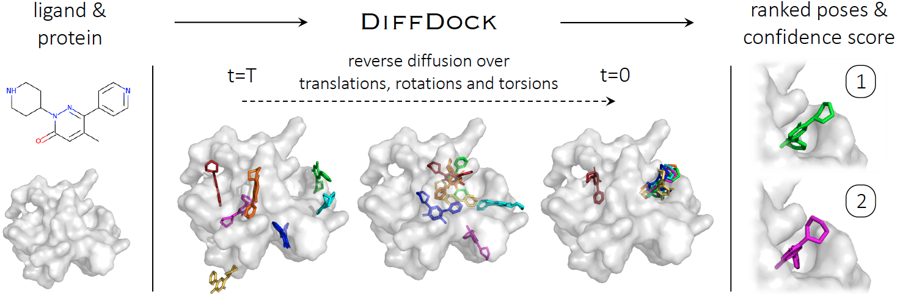

# DiffDock 示例：OneScience 中的分子对接

本示例将 DiffDock（DiffDock-L）分子对接模型集成到 OneScience 生物信息组件中。所有源码入口均通过 `onescience.*` 路由，支持 score 模型训练、分子采样、数据集评估以及 confidence 模型训练。

DiffDock 是由 Corso 等人在 ICLR 2023 提出的扩散模型分子对接方法，通过 SO(3)/SE(3) 上的扩散过程同时建模配体相对受体的平移、旋转和扭转角。DiffDock-L 是其 2024 年更新的版本，在泛化能力上有显著提升。本示例默认对应官方仓库的 DiffDock-L 主路径（CGModel）。


---

## 目录

- [DiffDock 简介](#diffdock-简介)
- [支持范围](#支持范围)
- [环境准备](#环境准备)
- [数据准备](#数据准备)
- [脚本速查表](#脚本速查表)
- [脚本逐行说明](#脚本逐行说明)
  - [train.sh](#trainsh)
  - [train_demo.sh](#train_demosh)
  - [infer.sh](#infersh)
  - [train_slurm.sbatch](#train_slurmsbatch)
  - [infer_slurm.sbatch](#infer_slurmsbatch)
- [详细使用说明](#详细使用说明)
  - [1. Score 模型训练](#1-score-模型训练)
  - [2. 分子采样](#2-分子采样)
  - [3. 数据集评估](#3-数据集评估)
  - [4. Confidence 模型训练](#4-confidence-模型训练)
- [Slurm 作业提交](#slurm-作业提交)
- [目录结构](#目录结构)
- [常见问题与注意事项](#常见问题与注意事项)
- [引用](#引用)

---

## DiffDock 简介

DiffDock 把分子对接看成一个生成式建模问题：给定一个蛋白（受体）和一个小分子（配体），模型学习生成配体在受体结合口袋中的 3D 构象。它同时建模三个自由度：

- **平移 (translation)**：配体在 3D 空间中的位置；
- **旋转 (rotation)**：配体整体朝向；
- **扭转 (torsion)**：配体内部可旋转键的二面角。

模型训练时通过 score matching 学习反向扩散过程的 score；推理时使用逆扩散采样，从一个随机初始姿态逐步去噪，得到候选结合构象。

官方仓库地址：https://github.com/gcorso/DiffDock  
DiffDock-L 论文：https://arxiv.org/abs/2402.18396  
原始 DiffDock 论文：https://arxiv.org/abs/2210.01776

官方 README 中最重要的使用约定：

- 蛋白输入必须是 `.pdb` 文件，或一条氨基酸序列（将使用 ESMFold 折叠，但本示例当前未默认启用 ESMFold 路径）；
- 配体输入可以是 SMILES 字符串，或 RDKit 可读取的 `.sdf` / `.mol2` 文件；
- 首次在设备上运行会缓存 SO(2)/SO(3) 查找表，耗时几分钟，后续运行复用；
- Confidence score 不是结合亲和力，而是模型对预测构象质量的置信度。

---

## 支持范围

**当前迁移范围：CGModel 主路径。**

| 能力 | 状态 | Python 入口 |
|---|---|---|
| Score 模型训练（PDBBind） | 已支持 | `scripts/train_diffdock.py` |
| Score 模型训练（MOAD） | 已支持 | `scripts/train_diffdock.py` |
| Score 模型训练（泛化训练 `generalisation`） | 已支持 | `scripts/train_diffdock.py` |
| 单复合物采样 | 已支持 | `scripts/sample_diffdock.py` |
| CSV 批量采样 | 已支持 | `scripts/sample_diffdock.py` |
| Confidence 重排序（采样） | 已支持 | `scripts/sample_diffdock.py` |
| 数据集评估 | 已支持 | `scripts/evaluate.py` |
| Confidence 模型训练 | 已支持 | `onescience.confidence.diffdock.confidence_train` |
| GNINA 能量最小化（评估） | 已支持（可选） | `scripts/evaluate.py` |

** intentionally 未迁移 — 会直接抛出 `NotImplementedError`：**

- `all_atoms=true` / AAModel
- `old_score_model=true` / `old_confidence_model=true`
- `dataset=pdbsidechain` / `dataset=distillation`
- `triple_training=true`

---

## 环境准备

### 方式一：使用 OneScience 安装脚本（推荐）

1. 参考项目根目录 [README.md](../../../README.md) 完成 OneScience（bio 领域）安装：

    ```bash
    bash install.sh bio
    ```

2. 激活 Conda 环境：

    ```bash
    conda activate onescience311
    ```

3. 脚本依赖环境变量 `ONESCIENCE_DATASETS_DIR` 与 `ONESCIENCE_MODELS_DIR`，通常由项目根目录 `env.sh` 自动配置：

    ```bash
    source /path/to/onescience/env.sh
    ```

### 方式二：使用 Docker（与官方仓库一致）

如果仅想复现官方 DiffDock-L，也可以直接拉取官方镜像：

```bash
# 有 GPU
docker run -it --gpus all --entrypoint /bin/bash rbgcsail/diffdock

# 无 GPU（速度较慢）
docker run -it --entrypoint /bin/bash rbgcsail/diffdock

# 容器内
micromamba activate diffdock
```

OneScience 示例目录下的脚本默认面向 DCU/GPU 本地或 Slurm 环境，不依赖 Docker。

### 验证安装

```bash
python -c "import torch, rdkit, yaml; print('torch', torch.__version__); print('rdkit ok'); print('yaml ok')"
python -c "from onescience.models.diffdock.score_wrapper import load_score_model; print('onescience.diffdock ok')"
```

---

## 数据准备

OneScience 示例依赖预先处理好的数据集。常用默认路径：

| 用途 | 默认路径 |
|------|----------|
| 数据根目录 | `${ONESCIENCE_DATASETS_DIR}/diffdock` |
| PDBBind 处理数据 | `${ONESCIENCE_DATASETS_DIR}/diffdock/datasets/PDBBind_processed` |
| MOAD 处理数据 | `${ONESCIENCE_DATASETS_DIR}/diffdock/datasets/BindingMOAD_2020_processed` |
| 数据划分 | `${ONESCIENCE_DATASETS_DIR}/diffdock/datasets/splits` |
| Score 模型权重 | `${ONESCIENCE_DATASETS_DIR}/diffdock/score_model/best_ema_inference_epoch_model.pt` |
| Confidence 模型权重 | `${ONESCIENCE_DATASETS_DIR}/diffdock/confidence_model/best_model_epoch75.pt` |
| ESM torch cache | `${ONESCIENCE_DATASETS_DIR}/diffdock/torch_home` |
| 训练输出 | `examples/biosciences/diffdock/outputs/train/<RUN_NAME>` |
| 采样输出 | `examples/biosciences/diffdock/outputs/scnet_inference` |

### 官方数据集下载说明

根据官方 README，各数据集可从 Zenodo 获取：

- **PDBBind**：https://zenodo.org/record/6408497，下载解压后得到 `PDBBind_processed`。
- **BindingMOAD**：https://zenodo.org/records/10656052，下载 `BindingMOAD_2020_processed.tar` 并解压。
- **DockGen**：使用上面的 BindingMOAD 数据即可；若只想下载 DockGen 子集，可在同一 Zenodo 记录下载 `DockGen.tar`。
- **PoseBusters**：https://zenodo.org/records/8278563。
- **van der Mers 增强数据**：https://files.ipd.uw.edu/pub/training_sets/pdb_2021aug02.tar.gz。

将这些目录放置到 `${ONESCIENCE_DATASETS_DIR}/diffdock/datasets/` 下，并确认存在对应 `splits/` 目录中的划分文件（如 `timesplit_no_lig_overlap_train`、`timesplit_no_lig_overlap_val`、`timesplit_test`）。

### 划分文件格式

训练/验证/测试划分是纯文本文件，每行一个复合物名称（与 PDBBind/MOAD 目录下的子目录名一致），例如：

```text
3d2v
4fkw
6o5u
...
```

---

## 脚本速查表

以下 5 个脚本位于 `examples/biosciences/diffdock/scripts/`，为本示例的官方入口。

| 脚本 | 功能 | 推荐运行方式 | 输出 |
|------|------|--------------|------|
| `scripts/train.sh` | Score 模型完整训练 | 在 `diffdock` 目录下执行 `bash scripts/train.sh` | `outputs/train/<RUN_NAME>/` |
| `scripts/train_demo.sh` | Score 模型 smoke 训练（100 训练样本 / 20 验证样本） | 在 `diffdock` 目录下执行 `bash scripts/train_demo.sh` | `outputs/train/diffdock_pdbbind_smoke100_val20_cpu/` |
| `scripts/infer.sh` | 单复合物 / CSV 批量采样 | 在 `diffdock` 目录下执行 `bash scripts/infer.sh` | `outputs/scnet_inference/` |
| `scripts/train_slurm.sbatch` | Slurm 提交训练 | `sbatch scripts/train_slurm.sbatch` | Slurm 日志 + 训练输出 |
| `scripts/infer_slurm.sbatch` | Slurm 提交采样 | `sbatch scripts/infer_slurm.sbatch` | Slurm 日志 + 采样输出 |

---

## 脚本逐行说明

### `train.sh`

`train.sh` 负责生成一个 YAML 训练配置，然后调用 `scripts/train_diffdock.py`。

```bash
source ${ROCM_PATH}/cuda/env.sh
export LD_LIBRARY_PATH="$CONDA_PREFIX/lib/python3.11/site-packages/fastpt/torch/lib:$LD_LIBRARY_PATH"
export LD_LIBRARY_PATH=${ROCM_PATH}/opencl/lib:$LD_LIBRARY_PATH
```

- 加载 ROCm/DCU 环境变量与 fastpt 库路径，使 PyTorch 能正确调用 DCU 后端。如果在 CUDA 平台运行，可忽略或删除这些行。

```bash
set -euo pipefail
```

- 严格模式：命令失败立即退出；未定义变量报错；管道中任一命令失败即整体失败。

```bash
SCRIPT_DIR=$(cd "$(dirname "${BASH_SOURCE[0]}")" && pwd)
EXAMPLE_DIR=$(cd "${SCRIPT_DIR}/.." && pwd)
REPO_ROOT=$(cd "${SCRIPT_DIR}/../../../.." && pwd)
```

- 计算脚本所在目录、示例目录和仓库根目录，保证脚本无论从哪调用都能找到相对路径。

```bash
source "${REPO_ROOT}/env.sh"
```

- 加载项目根目录的环境变量（`ONESCIENCE_DATASETS_DIR`、`ONESCIENCE_MODELS_DIR` 等）。

```bash
if [[ -n "${ROCM_PATH:-}" && -f "${ROCM_PATH}/cuda/env.sh" ]]; then
  source "${ROCM_PATH}/cuda/env.sh"
fi
```

- 若 `ROCM_PATH` 存在，再次加载 DCU 环境（兼容某些 Slurm 场景）。

```bash
export PYTHONPATH="${REPO_ROOT}/src:${REPO_ROOT}:${PYTHONPATH:-}"
export HIP_VISIBLE_DEVICES="${HIP_VISIBLE_DEVICES:-0}"
export CUDA_VISIBLE_DEVICES="${CUDA_VISIBLE_DEVICES:-${HIP_VISIBLE_DEVICES}}"
export OMP_NUM_THREADS="${OMP_NUM_THREADS:-4}"
```

- 将仓库 `src` 加入 Python 路径；默认使用 GPU 0；限制 OpenMP 线程数。

```bash
DIFFDOCK_DATA_ROOT="${DIFFDOCK_DATA_ROOT:-${ONESCIENCE_DATASETS_DIR}/diffdock}"
DIFFDOCK_DATASETS_DIR="${DIFFDOCK_DATASETS_DIR:-${DIFFDOCK_DATA_ROOT}/datasets}"
export TORCH_HOME="${TORCH_HOME:-${DIFFDOCK_DATA_ROOT}/torch_home}"
```

- 计算数据根目录、数据集子目录与 torch cache 目录。可通过环境变量覆盖。

```bash
DATASET="${DATASET:-pdbbind}"
RUN_NAME="${RUN_NAME:-diffdock_${DATASET}_scnet}"
LOG_DIR="${LOG_DIR:-${EXAMPLE_DIR}/outputs/train}"
CACHE_PATH="${CACHE_PATH:-${EXAMPLE_DIR}/outputs/cache}"
CONFIG_PATH="${CONFIG_PATH:-${LOG_DIR}/${RUN_NAME}_train_config.yml}"
```

- 默认数据集为 `pdbbind`，可改为 `moad` 或 `generalisation`；输出目录为示例目录下的 `outputs/`。

```bash
PDBBIND_DIR="${PDBBIND_DIR:-${DIFFDOCK_DATASETS_DIR}/PDBBind_processed}"
MOAD_DIR="${MOAD_DIR:-${DIFFDOCK_DATASETS_DIR}/BindingMOAD_2020_processed}"
SPLIT_TRAIN="${SPLIT_TRAIN:-${DIFFDOCK_DATASETS_DIR}/splits/timesplit_no_lig_overlap_train}"
SPLIT_VAL="${SPLIT_VAL:-${DIFFDOCK_DATASETS_DIR}/splits/timesplit_no_lig_overlap_val}"
```

- 默认训练/验证划分使用官方时间划分。

```bash
DEVICE="${DEVICE:-auto}"
if [[ "$DEVICE" == "auto" ]]; then
    if python -c "import torch; print(torch.cuda.is_available())" | grep -q True; then
        DEVICE="cuda"
    else
        DEVICE="cpu"
    fi
fi
```

- 自动检测 GPU；无 GPU 则回退 CPU。

```bash
SEED="${SEED:-0}"
BATCH_SIZE="${BATCH_SIZE:-4}"
N_EPOCHS="${N_EPOCHS:-10}"
LR="${LR:-0.001}"
NUM_WORKERS="${NUM_WORKERS:-1}"
NUM_DATALOADER_WORKERS="${NUM_DATALOADER_WORKERS:-0}"
LIMIT_COMPLEXES="${LIMIT_COMPLEXES:-null}"
```

- 训练超参数默认值。`LIMIT_COMPLEXES` 可限制加载的复合物数量，用于快速 smoke 测试。

```bash
cat > "${CONFIG_PATH}" <<EOF
...
EOF
```

- 生成完整 YAML 配置文件，写入 `runtime/data/diffusion/model/optimization/validation` 等区块。脚本只暴露常用变量；更多参数可直接编辑生成的 YAML 或手写 `configs/training.yml`。

```bash
cd "${REPO_ROOT}"
python "${SCRIPT_DIR}/train_diffdock.py" --config "${CONFIG_PATH}"
```

- 切换至仓库根目录并启动训练。

### `train_demo.sh`

`train_demo.sh` 与 `train.sh` 结构相同，但默认使用：

- `RUN_NAME=diffdock_pdbbind_smoke100_val20_cpu`
- `BATCH_SIZE=2`
- `N_EPOCHS=1`
- `SPLIT_TRAIN=timesplit_no_lig_overlap_train_smoke100`
- `SPLIT_VAL=timesplit_no_lig_overlap_val_smoke20`
- `CACHE_PATH=outputs/cache_pdbbind_smoke100_val20`

适用于快速验证安装和环境是否能跑通训练流程。

### `infer.sh`

`infer.sh` 负责生成采样 YAML 配置并调用 `scripts/sample_diffdock.py`。

```bash
DIFFDOCK_DATA_ROOT="${DIFFDOCK_DATA_ROOT:-${ONESCIENCE_DATASETS_DIR}/diffdock}"
export TORCH_HOME="${TORCH_HOME:-${DIFFDOCK_DATA_ROOT}/torch_home}"

SCORE_MODEL_DIR="${SCORE_MODEL_DIR:-${DIFFDOCK_DATA_ROOT}/score_model}"
SCORE_CKPT="${SCORE_CKPT:-best_ema_inference_epoch_model.pt}"
CONFIDENCE_MODEL_DIR="${CONFIDENCE_MODEL_DIR:-${DIFFDOCK_DATA_ROOT}/confidence_model}"
CONFIDENCE_CKPT="${CONFIDENCE_CKPT:-best_model_epoch75.pt}"
ENABLE_CONFIDENCE="${ENABLE_CONFIDENCE:-true}"
OLD_CONFIDENCE_MODEL="${OLD_CONFIDENCE_MODEL:-true}"
```

- 默认加载预训练 score 和 confidence 模型；可通过环境变量覆盖路径。注意示例当前默认 `OLD_CONFIDENCE_MODEL=true`，是因为示例自带的 confidence 权重来自旧版结构；若使用新版，请设为 `false`。

```bash
DEFAULT_SHARED_CSV="${DIFFDOCK_DATA_ROOT}/datasets/inferdata/protein_ligand_example.csv"
PROTEIN_LIGAND_CSV="${PROTEIN_LIGAND_CSV:-}"
if [[ -z "${PROTEIN_LIGAND_CSV}" && -f "${DEFAULT_SHARED_CSV}" ]]; then
  PROTEIN_LIGAND_CSV="${DEFAULT_SHARED_CSV}"
fi
```

- 若未显式指定 `PROTEIN_LIGAND_CSV` 且共享目录存在 CSV，则自动使用 CSV 批量模式；否则回退单复合物模式。

```bash
COMPLEX_NAME="${COMPLEX_NAME:-6o5u_test}"
PROTEIN_PATH="${PROTEIN_PATH:-${EXAMPLE_DIR}/data/6o5u_protein_processed.pdb}"
PROTEIN_SEQUENCE="${PROTEIN_SEQUENCE:-}"
LIGAND_DESCRIPTION="${LIGAND_DESCRIPTION:-${EXAMPLE_DIR}/data/6o5u_ligand.sdf}"
```

- 单复合物模式默认值，使用仓库自带的 6o5u 样本。

```bash
SAMPLES_PER_COMPLEX="${SAMPLES_PER_COMPLEX:-10}"
BATCH_SIZE="${BATCH_SIZE:-10}"
INFERENCE_STEPS="${INFERENCE_STEPS:-20}"
ACTUAL_STEPS="${ACTUAL_STEPS:-}"
NO_RANDOM="${NO_RANDOM:-false}"
NO_FINAL_STEP_NOISE="${NO_FINAL_STEP_NOISE:-true}"
CROP_BEYOND="${CROP_BEYOND:-}"
```

- 采样超参数。`SAMPLES_PER_COMPLEX` 控制每个复合物生成 pose 数量；`INFERENCE_STEPS` 控制扩散步数。

```bash
yaml_value() { ... }
yaml_bool() { ... }
```

- 小工具函数：为空或 `null` 输出 YAML `null`，否则输出单引号字符串；布尔值统一转为小写 `true`/`false`。

```bash
if [[ "${ENABLE_CONFIDENCE,,}" == "true" ]]; then
  CONFIDENCE_MODEL_VALUE=$(yaml_value "${CONFIDENCE_MODEL_DIR}")
else
  CONFIDENCE_MODEL_VALUE="null"
fi
```

- 若关闭 confidence，则不写入 confidence 模型目录。

```bash
cat > "${CONFIG_PATH}" <<EOF
runtime:
  device: ...
  out_dir: ...
model:
  model_dir: ...
  ckpt: ...
confidence:
  confidence_model_dir: ...
  confidence_ckpt: ...
input:
  protein_ligand_csv: ...
  complex_name: ...
  protein_path: ...
  ligand_description: ...
sampling:
  samples_per_complex: ...
  inference_steps: ...
EOF
```

- 生成采样 YAML，结构见 `configs/sampling.yml`。

```bash
cd "${REPO_ROOT}"
python "${SCRIPT_DIR}/sample_diffdock.py" --config "${CONFIG_PATH}"
```

- 启动采样。

### `train_slurm.sbatch`

```bash
#SBATCH -J diffdock_train
#SBATCH -p largedev
#SBATCH -N 1
#SBATCH --ntasks-per-node=1
#SBATCH --gres=dcu:1
#SBATCH --cpus-per-task=8
#SBATCH --time=24:00:00
#SBATCH -o slurm-train-%j.out
#SBATCH -e slurm-train-%j.err
```

- 在 `largedev` 队列申请 1 节点、1 任务、1 张 DCU、8 CPU 核心，运行 24 小时。如使用 CUDA，把 `--gres=dcu:1` 改为 `--gres=gpu:1`。

```bash
module purge || true
module load sghpc-mpi-gcc/25.8 || true
```

- 加载集群模块，若失败也继续（`|| true`）。

```bash
srun bash "${SCRIPT_DIR}/train.sh"
```

- 通过 `srun` 调用 `train.sh`，复用本地脚本逻辑。

### `infer_slurm.sbatch`

与 `train_slurm.sbatch` 类似，区别仅在于：

```bash
#SBATCH -J diffdock_infer
#SBATCH --time=02:00:00
srun bash "${SCRIPT_DIR}/infer.sh"
```

- 默认运行 2 小时，调用 `infer.sh`。

---

## 详细使用说明

### 1. Score 模型训练

**方式一：完整训练（`scripts/train.sh`）**

```bash
cd examples/biosciences/diffdock
bash scripts/train.sh
```

默认配置：

- 数据集：`pdbbind`
- 运行名称：`diffdock_pdbbind_scnet`
- 数据：`${ONESCIENCE_DATASETS_DIR}/diffdock/datasets/PDBBind_processed`
- 训练/验证划分：`timesplit_no_lig_overlap_train` / `timesplit_no_lig_overlap_val`
- 日志输出：`outputs/train/diffdock_pdbbind_scnet/`
- 缓存：`outputs/cache/`

**方式二：Smoke 快速验证（`scripts/train_demo.sh`）**

```bash
cd examples/biosciences/diffdock
bash scripts/train_demo.sh
```

默认使用 100 样本训练子集和 20 样本验证子集，单 epoch，适合快速验证安装。

**常用环境变量覆盖：**

| 环境变量 | 默认值 | 说明 |
|----------|--------|------|
| `DATASET` | `pdbbind` | 数据集，可选 `pdbbind` / `moad` / `generalisation` |
| `RUN_NAME` | `diffdock_${DATASET}_scnet` | 训练运行名称 |
| `LOG_DIR` | `./outputs/train` | 日志与检查点根目录 |
| `CACHE_PATH` | `./outputs/cache` | 数据缓存目录 |
| `CONFIG_PATH` | `${LOG_DIR}/${RUN_NAME}_train_config.yml` | 生成的训练配置文件路径 |
| `DEVICE` | `auto` | 计算设备，可选 `cuda`、`cpu` 等 |
| `BATCH_SIZE` | `4` | 批次大小 |
| `N_EPOCHS` | `10` | 训练轮数 |
| `LR` | `0.001` | 学习率 |
| `SEED` | `0` | 随机种子 |
| `NUM_WORKERS` | `1` | 数据预处理进程数 |
| `NUM_DATALOADER_WORKERS` | `0` | DataLoader 工作进程数 |
| `LIMIT_COMPLEXES` | `null` | 限制加载的复合物数量 |
| `WANDB` | `false` | 是否启用 wandb 日志 |
| `NO_TORSION` | `false` | 是否关闭扭转角扩散 |
| `PDBBIND_DIR` | `${DIFFDOCK_DATASETS_DIR}/PDBBind_processed` | PDBBind 数据目录 |
| `MOAD_DIR` | `${DIFFDOCK_DATASETS_DIR}/BindingMOAD_2020_processed` | MOAD 数据目录 |
| `SPLIT_TRAIN` | `${DIFFDOCK_DATASETS_DIR}/splits/timesplit_no_lig_overlap_train` | 训练集划分文件 |
| `SPLIT_VAL` | `${DIFFDOCK_DATASETS_DIR}/splits/timesplit_no_lig_overlap_val` | 验证集划分文件 |

**示例：**

```bash
# 完整训练：MOAD 数据集
DATASET=moad RUN_NAME=diffdock_moad BATCH_SIZE=4 N_EPOCHS=10 bash scripts/train.sh

# 快速 smoke 测试
LIMIT_COMPLEXES=100 N_EPOCHS=1 RUN_NAME=diffdock_smoke bash scripts/train.sh
```

脚本会自动生成 YAML 配置文件，并调用 `python scripts/train_diffdock.py --config <config>` 启动训练。

训练结束后的检查点：

- `last_model.pt` — 最后一个 epoch
- `best_model.pt` — 最佳验证 loss
- `best_inference_epoch_model.pt` — 最佳推理指标（需设置 `VAL_INFERENCE_FREQ`）
- `best_ema_*.pt` — EMA 变体

---

### 2. 分子采样

```bash
cd examples/biosciences/diffdock
bash scripts/infer.sh
```

默认行为：

- 输入：`data/6o5u_protein_processed.pdb` + `data/6o5u_ligand.sdf`
- Score 模型：`${ONESCIENCE_DATASETS_DIR}/diffdock/score_model/best_ema_inference_epoch_model.pt`
- Confidence 模型：`${ONESCIENCE_DATASETS_DIR}/diffdock/confidence_model/best_model_epoch75.pt`
- 输出：`outputs/scnet_inference/`
- 每复合物采样数：10

**常用环境变量覆盖：**

| 环境变量 | 默认值 | 说明 |
|----------|--------|------|
| `SCORE_MODEL_DIR` | `${DIFFDOCK_DATA_ROOT}/score_model` | score 模型目录 |
| `SCORE_CKPT` | `best_ema_inference_epoch_model.pt` | score 模型权重文件名 |
| `CONFIDENCE_MODEL_DIR` | `${DIFFDOCK_DATA_ROOT}/confidence_model` | confidence 模型目录 |
| `CONFIDENCE_CKPT` | `best_model_epoch75.pt` | confidence 模型权重文件名 |
| `ENABLE_CONFIDENCE` | `true` | 是否启用 confidence 重排序 |
| `OLD_CONFIDENCE_MODEL` | `true` | 是否为旧版 confidence 模型 |
| `PROTEIN_LIGAND_CSV` | `${DIFFDOCK_DATA_ROOT}/datasets/inferdata/protein_ligand_example.csv` | CSV 批量输入文件 |
| `COMPLEX_NAME` | `6o5u_test` | 单复合物名称 |
| `PROTEIN_PATH` | `./data/6o5u_protein_processed.pdb` | 单复合物蛋白 PDB |
| `LIGAND_DESCRIPTION` | `./data/6o5u_ligand.sdf` | 单复合物配体（SMILES 或 SDF/mol2） |
| `PROTEIN_SEQUENCE` | `` | 蛋白序列（可选，ESMFold 路径） |
| `OUT_DIR` | `./outputs/scnet_inference` | 输出目录 |
| `CONFIG_PATH` | `${OUT_DIR}/inference_config.yml` | 生成的推理配置文件路径 |
| `DEVICE` | `auto` | 计算设备 |
| `SAMPLES_PER_COMPLEX` | `10` | 每复合物采样数 |
| `BATCH_SIZE` | `10` | 推理批次大小 |
| `INFERENCE_STEPS` | `20` | 扩散步数 |
| `ACTUAL_STEPS` | `` | 实际使用步数（可选） |
| `NO_RANDOM` | `false` | 是否关闭随机初始化 |
| `NO_FINAL_STEP_NOISE` | `true` | 是否关闭最后一步噪声 |
| `CROP_BEYOND` | `` | 蛋白裁剪距离（可选） |

**CSV 批量推理示例：**

```bash
PROTEIN_LIGAND_CSV=/path/to/your_inputs.csv \
OUT_DIR=./outputs/my_batch \
SAMPLES_PER_COMPLEX=10 \
BATCH_SIZE=10 \
bash scripts/infer.sh
```

CSV 文件列说明：

| 列名 | 是否必填 | 说明 |
|------|----------|------|
| `complex_name` | 是 | 复合物唯一标识 |
| `protein_path` | 是 | 受体 PDB 文件路径 |
| `ligand_description` | 是 | SMILES 字符串或 SDF/mol2 路径 |
| `protein_sequence` | 否 | 氨基酸序列（单字母） |

**单复合物推理示例：**

```bash
PROTEIN_LIGAND_CSV="" \
PROTEIN_PATH=/path/to/protein.pdb \
LIGAND_DESCRIPTION="COc1ccc(CC(C)N)cc1" \
COMPLEX_NAME=my_complex \
OUT_DIR=./outputs/single_infer \
bash scripts/infer.sh
```

**Confidence 重排序：**

当 `ENABLE_CONFIDENCE=true` 且 confidence 模型路径有效时，采样脚本会：

1. 使用 score 模型进行常规去噪采样。
2. 使用 confidence 模型对每个 pose 打分。
3. 按 confidence 分数降序排列。
4. 输出文件名包含 confidence 分数，例如 `rank1_conf0.9234.sdf`。

Confidence score 解释（参考官方 FAQ）：

- `c > 0`：高置信度；
- `-1.5 < c < 0`：中等置信度；
- `c < -1.5`：低置信度。

注意：该分数衡量的是模型对预测结合构象质量的信心，**不是结合亲和力**。

---

### 3. 数据集评估

```bash
cd examples/biosciences/diffdock
export PYTHONPATH=../../../src:$PYTHONPATH
python scripts/evaluate.py --config configs/evaluate.yml
```

功能：

- 在测试数据集上评估训练好的 score 模型。
- 可选 confidence checkpoint 进行重排序。
- 可选 GNINA 能量最小化（需配置 `gnina.gnina_minimize: true` 并安装 `gnina` 可执行文件）。
- 输出指标：RMSD 分位数、重心距离、自交比例等，以 `.npy` 文件保存到 `out_dir`。

对应官方 README 中的复现命令，本示例入口为 `scripts/evaluate.py`：

- **PDBBind**：设置 `data.dataset=pdbbind`，`data.data_dir=<PDBBind_processed>`，`data.split_path=<timesplit_test>`。
- **DockGen**：设置 `data.dataset=moad`，`data.data_dir=<BindingMOAD_2020_processed>`，`data.unroll_clusters=true`，并提供 `moad_esm_embeddings_sequences_path`。
- **PoseBusters**：设置 `data.dataset=posebusters`，`data.data_dir=<posebusters_benchmark_set>`，`data.split_path=<posebusters_benchmark_set_ids.txt>`。

---

### 4. Confidence 模型训练

Confidence 模型训练没有单独的示例脚本，直接调用模块：

```bash
cd examples/biosciences/diffdock
export PYTHONPATH=../../../src:$PYTHONPATH

python -m onescience.confidence.diffdock.confidence_train \
  --original_model_dir ./outputs/train/diffdock_cg_example \
  --data_dir ${ONESCIENCE_DATASETS_DIR}/diffdock/datasets/PDBBind_processed \
  --split_train ${ONESCIENCE_DATASETS_DIR}/diffdock/datasets/splits/timesplit_no_lig_overlap_train \
  --split_val ${ONESCIENCE_DATASETS_DIR}/diffdock/datasets/splits/timesplit_no_lig_overlap_val \
  --run_name confidence_cg \
  --n_epochs 50 \
  --rmsd_classification_cutoff 2.0
```

也支持使用 YAML 配置文件：

```bash
python -m onescience.confidence.diffdock.confidence_train --config confidence_config.yml
```

实现位于 `src/onescience/confidence/diffdock/`，仅支持 CGModel 路径。

---

## Slurm 作业提交

训练：

```bash
cd examples/biosciences/diffdock
sbatch scripts/train_slurm.sbatch
```

采样：

```bash
cd examples/biosciences/diffdock
sbatch scripts/infer_slurm.sbatch
```

提交前请根据集群环境修改：

- `-p largedev` 队列名；
- `--gres=dcu:1` 改为 `--gres=gpu:1` 如果是英伟达 GPU；
- `--time` 运行时长；
- `module load ...` 加载正确的编译器/MPI 模块。

---

## 目录结构

```
examples/biosciences/diffdock/
├── configs/
│   ├── training.yml              # 训练配置模板
│   ├── sampling.yml              # 采样配置模板
│   └── evaluate.yml              # 评估配置模板
├── scripts/
│   ├── train.sh                  # 完整训练入口脚本
│   ├── train_demo.sh             # Smoke 训练入口脚本
│   ├── infer.sh                  # 推理采样入口脚本
│   ├── train_slurm.sbatch        # Slurm 训练提交脚本
│   ├── infer_slurm.sbatch        # Slurm 推理提交脚本
│   ├── train_diffdock.py         # Score 模型训练 Python 入口
│   ├── sample_diffdock.py        # 单复合物 / CSV 采样 Python 入口
│   └── evaluate.py               # 数据集评估 Python 入口
├── data/                         # 示例输入数据（6o5u、1a46）
├── outputs/
│   ├── train/                    # 训练输出
│   ├── scnet_inference/          # 采样输出
│   └── cache/                    # 数据缓存
└── README.md
```

对应源码模块：

```
src/onescience/
├── datapipes/diffdock/           # PDBBind、MOAD 数据集与 DataLoader
├── models/diffdock/              # CGModel、TensorProductConvLayer、score_wrapper
├── utils/diffdock/               # 扩散工具、SO3/torus、采样、训练、评估
└── confidence/diffdock/          # Confidence 数据集与训练
```

---

## 常见问题与注意事项

- **运行脚本前请确保 `ONESCIENCE_DATASETS_DIR` 与 `ONESCIENCE_MODELS_DIR` 已设置**（执行项目根目录 `env.sh` 即可）。
- 建议所有入口脚本都在 `examples/biosciences/diffdock` 目录下执行，以便正确生成相对路径的输出目录。
- 手动运行 Python 入口时，需将项目根目录的 `src` 加入 `PYTHONPATH`：`export PYTHONPATH=/path/to/onescience/src:$PYTHONPATH`。
- 脚本会自动设置 ROCm/DCU 相关的 `LD_LIBRARY_PATH`，在海光 DCU 平台可直接运行；在 CUDA 平台可忽略或按需调整。
- 采样与评估依赖 RDKit、OpenBabel、可选 `spyrmsd` 与 `gnina`。
- 若使用 ESM 嵌入（`esm_embeddings_model`），需安装 `esm` 包并设置 `TORCH_HOME`。
- 训练脚本默认单卡运行，多卡训练请调整 `CUDA_VISIBLE_DEVICES` / `HIP_VISIBLE_DEVICES` 及分布式配置。
- 遇到 `NotImplementedError` 且涉及 `all_atoms`、`old_score_model`、`pdbsidechain`、`distillation`、`triple_training` 时，说明该路径未在 OneScience 迁移范围内。
- DiffDock 仅适用于小分子-蛋白对接，不推荐用于蛋白-蛋白或蛋白-核酸相互作用。
- 首次运行会在 `TORCH_HOME` 下生成 SO(2)/SO(3) 查找表缓存，耗时几分钟，后续运行更快。

---

## 引用

如果使用 DiffDock，请引用原始论文：

```bibtex
@inproceedings{corso2023diffdock,
    title={DiffDock: Diffusion Steps, Twists, and Turns for Molecular Docking},
    author = {Corso, Gabriele and Stärk, Hannes and Jing, Bowen and Barzilay, Regina and Jaakkola, Tommi},
    booktitle={International Conference on Learning Representations (ICLR)},
    year={2023}
}
```

如果使用 DiffDock-L，请额外引用：

```bibtex
@inproceedings{corso2024discovery,
    title={Deep Confident Steps to New Pockets: Strategies for Docking Generalization},
    author={Corso, Gabriele and Deng, Arthur and Polizzi, Nicholas and Barzilay, Regina and Jaakkola, Tommi},
    booktitle={International Conference on Learning Representations (ICLR)},
    year={2024}
}
```
