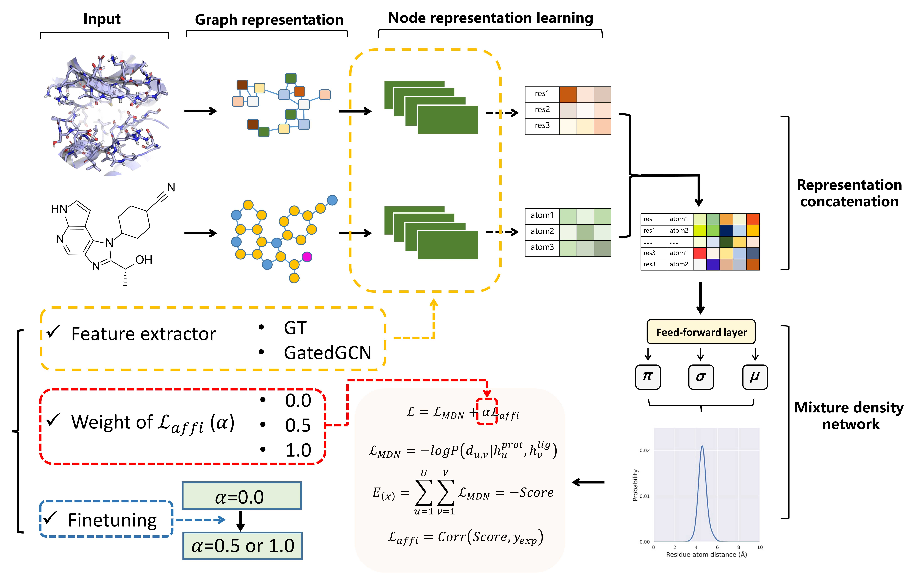

# GenScore 示例

本示例将 GenScore 集成到 OneScience 生物信息（AI for Biology）组件中，提供蛋白-配体打分、口袋生成、贡献度分析、模型训练以及 CASF-2016 基准评测的统一入口。

## GenScore 简介

GenScore 是一个基于图神经网络的**蛋白质-配体打分框架**，由 RTMScore 扩展而来。它能够预测蛋白-小分子结合亲和力并评估对接构象质量，在多个数据集上展现出均衡的打分（scoring）、排序（ranking）、对接（docking）和虚拟筛选（screening）能力。

<div align="center">
    
</div>

## 目录

- [功能定位](#功能定位)
- [环境准备](#环境准备)
- [数据与模型权重](#数据与模型权重)
- [脚本速查表](#脚本速查表)
- [详细使用说明](#详细使用说明)
  - [1. 蛋白-配体打分推理（`run_genscore.sh`）](#1-蛋白-配体打分推理run_genscoresh)
  - [2. 模型训练](#2-模型训练)
    - [2.1 小规模冒烟测试（`train_genscore_smoke.sh`）](#21-小规模冒烟测试train_genscore_smokesh)
    - [2.2 完整训练（`train_genscore_full.sh`）](#22-完整训练train_genscore_fullsh)
  - [3. CASF-2016 基准评测（`run_genscore_benchmarks.sh`）](#3-cASF-2016-基准评测run_genscore_benchmarkssh)
- [数据预处理](#数据预处理)
- [目录结构](#目录结构)
- [注意事项](#注意事项)
- [引用](#引用)

---

## 功能定位

- **蛋白-配体打分**：对给定蛋白（或已提取的结合口袋）与配体构象预测结合分数。
- **口袋自动生成**：基于参考配体位置从完整蛋白结构中自动截取结合口袋。
- **贡献度分析**：输出原子级别和残基级别对最终打分值的贡献，辅助可解释性分析。
- **模型训练**：基于 PDBbind 预处理后的蛋白-配体图数据训练 GenScore 打分网络。
- **CASF-2016 基准评测**：支持打分/排序（scoring/ranking）、对接（docking）和虚拟筛选（screening）三项标准测试。

---

## 环境准备

1. 参照项目根目录 [README.md](../../../README.md) 完成 OneScience（bio 领域）安装：

    ```bash
    bash install.sh bio
    ```

2. 激活 Conda 环境：

    ```bash
    conda activate onescience311
    ```

3. 确保 `ONESCIENCE_DATASETS_DIR` 环境变量已设置（通常由项目根目录 `env.sh` 自动配置）：

    ```bash
    source /path/to/onescience/env.sh
    ```

4. GenScore 原始实现依赖以下包，OneScience 环境中已通过 `install.sh bio` 完成安装：

    | 包 | 参考版本 |
    |---|---|
    | python | 3.8.11 / 3.11 |
    | pytorch | 1.11.0 / ≥2.0 |
    | torch-geometric | 2.0.3 / ≥2.0 |
    | torch-scatter | 2.0.9 / ≥2.0 |
    | rdkit | 2021.03.5 / 兼容版本 |
    | openbabel | 3.1.0 / 兼容版本 |
    | mdanalysis | 2.0.0 |
    | prody | 2.1.0 |
    | pandas | 1.3.2 |
    | scikit-learn | 0.24.2 |
    | scipy | 1.6.2 |
    | seaborn | 0.11.2 |
    | matplotlib | 3.4.3 |
    | joblib | 1.0.1 |

---

## 数据与模型权重

### 1. 推理示例数据

脚本默认读取：

```
${ONESCIENCE_DATASETS_DIR}/GenScore/genscore_data/inferdata
```

需要包含以下文件：

- `1qkt_p.pdb`：完整蛋白结构
- `1qkt_l.sdf`：参考配体（用于自动生成口袋）
- `1qkt_decoys.sdf`：待打分的 decoy 配体构象
- `1qkt_p_pocket_10.0.pdb`：已预提取的 10Å 结合口袋

### 2. 预训练模型权重

脚本默认读取：

```
${ONESCIENCE_DATASETS_DIR}/GenScore/trained_models
```

需要包含以下权重文件：

- `GT_0.0_1.pth`：GT 编码器模型
- `GatedGCN_0.5_1.pth`：GatedGCN 编码器模型
- `GatedGCN_ft_1.0_1.pth`：GatedGCN 微调模型（用于贡献度分析）

### 3. 训练数据

脚本默认读取预处理后的 PDBbind v2020 图数据：

```
${ONESCIENCE_DATASETS_DIR}/GenScore/genscore_data/rtmscore_s
```

需要包含以下文件：

- `<data_prefix>_ids.npy`
- `<data_prefix>_lig.pt`
- `<data_prefix>_prot.pt`

### 4. CASF-2016 基准数据

```
${ONESCIENCE_DATASETS_DIR}/GenScore/genscore_data/CASF-2016
${ONESCIENCE_DATASETS_DIR}/GenScore/genscore_data/PDBbind_v2020
${ONESCIENCE_DATASETS_DIR}/GenScore/genscore_data/rtmscore_s
```

### 5. 默认路径汇总

| 用途 | 默认路径 |
|------|----------|
| 推理输入数据 | `${ONESCIENCE_DATASETS_DIR}/GenScore/genscore_data/inferdata` |
| 预训练模型权重 | `${ONESCIENCE_DATASETS_DIR}/GenScore/trained_models` |
| 训练数据 | `${ONESCIENCE_DATASETS_DIR}/GenScore/genscore_data/rtmscore_s` |
| CASF-2016 数据 | `${ONESCIENCE_DATASETS_DIR}/GenScore/genscore_data/CASF-2016` |
| PDBbind 数据 | `${ONESCIENCE_DATASETS_DIR}/GenScore/genscore_data/PDBbind_v2020` |

---

## 脚本速查表

以下 4 个 `bash` 脚本为本示例的官方入口，均可直接运行。

| 脚本 | 功能 | 推荐运行方式 | 默认输出 |
|------|------|--------------|----------|
| `run_genscore.sh` | 蛋白-配体打分推理 | `bash run_genscore.sh` | `out/` 目录下的 CSV 文件 |
| `train_genscore_smoke.sh` | 小规模训练冒烟测试 | `bash train_genscore_smoke.sh` | `genscore_smoke_bs16.pth` |
| `train_genscore_full.sh` | 完整模型训练 | `bash train_genscore_full.sh` | `genscore_gatedgcn_full_3000.pth` |
| `run_genscore_benchmarks.sh` | CASF-2016 基准评测 | `bash run_genscore_benchmarks.sh all` | `benchmark_outputs/` |

以上脚本均位于 `examples/biosciences/genscore/` 目录。

---

## 详细使用说明

建议在 `examples/biosciences/genscore` 目录下运行脚本，以便输出目录统一。

### 1. 蛋白-配体打分推理（`run_genscore.sh`）

```bash
cd examples/biosciences/genscore
bash run_genscore.sh
```

该脚本依次运行 4 个推理示例，覆盖常见使用场景：

1. **GT 模型 + 自动生成口袋**：输入完整蛋白、参考配体与 decoy 配体，自动生成结合口袋后打分。
2. **GatedGCN 模型 + 预提取口袋**：输入已预提取的口袋 PDB 与 decoy 配体进行打分。
3. **原子贡献分析**：使用 GatedGCN 模型计算每个原子对打分的贡献。
4. **残基贡献分析**：使用 GatedGCN 模型计算每个残基对打分的贡献。

脚本内部调用：

```bash
# 1. GT scoring with generated pocket
python genscore.py \
  -p "${DATA_DIR}/1qkt_p.pdb" \
  -l "${DATA_DIR}/1qkt_decoys.sdf" \
  -rl "${DATA_DIR}/1qkt_l.sdf" \
  -gen_pocket -c 10.0 -e gt \
  -m "${MODEL_DIR}/GT_0.0_1.pth" \
  -o examples/biosciences/genscore/out \
  --batch_size 8 --num_workers 0

# 2. GatedGCN scoring with prepared pocket
python genscore.py \
  -p "${DATA_DIR}/1qkt_p_pocket_10.0.pdb" \
  -l "${DATA_DIR}/1qkt_decoys.sdf" \
  -e gatedgcn \
  -m "${MODEL_DIR}/GatedGCN_0.5_1.pth" \
  -o examples/biosciences/genscore/out \
  --batch_size 8 --num_workers 0

# 3. Atom contribution scoring
python genscore.py \
  -p "${DATA_DIR}/1qkt_p_pocket_10.0.pdb" \
  -l "${DATA_DIR}/1qkt_decoys.sdf" \
  -e gatedgcn -ac \
  -m "${MODEL_DIR}/GatedGCN_ft_1.0_1.pth" \
  -o examples/biosciences/genscore/out \
  --batch_size 8 --num_workers 0

# 4. Residue contribution scoring
python genscore.py \
  -p "${DATA_DIR}/1qkt_p_pocket_10.0.pdb" \
  -l "${DATA_DIR}/1qkt_decoys.sdf" \
  -e gatedgcn -rc \
  -m "${MODEL_DIR}/GatedGCN_ft_1.0_1.pth" \
  -o examples/biosciences/genscore/out \
  --batch_size 8 --num_workers 0
```

可通过环境变量覆盖默认配置：

| 环境变量 | 说明 | 默认值 |
|----------|------|--------|
| `GENSCORE_MODEL_DIR` | 预训练模型权重目录 | `${ONESCIENCE_DATASETS_DIR}/GenScore/trained_models` |
| `GENSCORE_DATA_DIR` | 推理输入数据目录 | `${ONESCIENCE_DATASETS_DIR}/GenScore/genscore_data/inferdata` |
| `GENSCORE_BATCH_SIZE` | 推理批次大小 | `8` |
| `GENSCORE_NUM_WORKERS` | 数据加载线程数 | `0` |

示例：

```bash
GENSCORE_MODEL_DIR=/path/to/models \
GENSCORE_DATA_DIR=/path/to/inferdata \
GENSCORE_BATCH_SIZE=16 \
bash run_genscore.sh
```

**`genscore.py` 主要参数说明：**

| 参数 | 是否必填 | 说明 |
|------|----------|------|
| `-p` / `--protein` | 是 | 蛋白 PDB 或口袋 PDB 路径 |
| `-l` / `--ligand` | 是 | 配体 SDF 路径（可包含多个构象） |
| `-rl` / `--ref_ligand` | 否 | 参考配体 SDF，用于自动生成口袋 |
| `-gen_pocket` | 否 | 基于参考配体自动生成结合口袋 |
| `-c` / `--cutoff` | 否 | 口袋截断距离，默认 `10.0` Å |
| `-e` / `--encoder` | 否 | 图编码器类型，可选 `gt`、`gatedgcn`，默认 `gt` |
| `-m` / `--model` | 是 | 模型权重路径 |
| `-o` / `--out` | 否 | 输出目录前缀 |
| `-ac` / `--atom_contribution` | 否 | 计算原子级别贡献 |
| `-rc` / `--residue_contribution` | 否 | 计算残基级别贡献 |
| `--batch_size` | 否 | 推理批次大小 |
| `--num_workers` | 否 | 数据加载线程数 |

输出：

- `out_gt.csv`：GT 模型打分结果
- `out_gatedgcn.csv`：GatedGCN 模型打分结果
- `out_at.csv`：原子贡献分析结果
- `out_res.csv`：残基贡献分析结果

---

### 2. 模型训练

#### 2.1 小规模冒烟测试（`train_genscore_smoke.sh`）

```bash
cd examples/biosciences/genscore
bash train_genscore_smoke.sh
```

默认配置：

| 参数 | 默认值 |
|------|--------|
| 训练轮数 | 100 |
| 批次大小 | 16 |
| 验证集样本数 | 1500 |
| 编码器 | `gatedgcn` |
| 输出模型 | `genscore_smoke_bs16.pth` |

脚本内部调用：

```bash
python train_genscore.py \
  --data_dir "${GENSCORE_DATA_DIR}" \
  --data_prefix "${GENSCORE_DATA_PREFIX}" \
  --model_path "${GENSCORE_MODEL_PATH}" \
  --num_epochs 100 \
  --batch_size 16 \
  --num_workers 0 \
  --valnum 1500 \
  --encoder "${GENSCORE_ENCODER:-gatedgcn}"
```

#### 2.2 完整训练（`train_genscore_full.sh`）

```bash
cd examples/biosciences/genscore
bash train_genscore_full.sh
```

默认配置：

| 参数 | 默认值 |
|------|--------|
| 训练轮数 | 3000 |
| 批次大小 | 64 |
| 验证集样本数 | 1500 |
| 早停耐心值 | 70 |
| 编码器 | `gatedgcn` |
| 输出模型 | `genscore_gatedgcn_full_3000.pth` |

脚本内部调用：

```bash
python train_genscore.py \
  --data_dir "${GENSCORE_DATA_DIR}" \
  --data_prefix "${GENSCORE_DATA_PREFIX}" \
  --model_path "${GENSCORE_MODEL_PATH}" \
  --num_epochs 3000 \
  --batch_size 64 \
  --num_workers 8 \
  --valnum 1500 \
  --patience 70 \
  --encoder "${GENSCORE_ENCODER}"
```

支持通过环境变量覆盖关键参数：

| 环境变量 | 说明 | 默认值 |
|----------|------|--------|
| `GENSCORE_DATA_DIR` | 训练数据目录 | `${ONESCIENCE_DATASETS_DIR}/GenScore/genscore_data/rtmscore_s` |
| `GENSCORE_DATA_PREFIX` | 数据文件前缀 | `v2020_train` |
| `GENSCORE_ENCODER` | 图编码器类型 | `gatedgcn` |
| `GENSCORE_MODEL_PATH` | 输出模型路径 | `examples/biosciences/genscore/genscore_${GENSCORE_ENCODER}_full_3000.pth` |
| `GENSCORE_NUM_EPOCHS` | 训练轮数 | `3000` |
| `GENSCORE_BATCH_SIZE` | 批次大小 | `64` |
| `GENSCORE_NUM_WORKERS` | 数据加载线程数 | `8` |
| `GENSCORE_VALNUM` | 验证集样本数 | `1500` |
| `GENSCORE_PATIENCE` | 早停耐心值 | `70` |

示例：

```bash
GENSCORE_ENCODER=gt \
GENSCORE_NUM_EPOCHS=1000 \
GENSCORE_BATCH_SIZE=32 \
bash train_genscore_full.sh
```

---

### 3. CASF-2016 基准评测（`run_genscore_benchmarks.sh`）

```bash
cd examples/biosciences/genscore
bash run_genscore_benchmarks.sh all
```

可单独运行某一项评测任务：

```bash
bash run_genscore_benchmarks.sh scoring
bash run_genscore_benchmarks.sh docking
bash run_genscore_benchmarks.sh screening
```

评测任务说明：

| 任务 | 说明 |
|------|------|
| `scoring` | 打分能力评测（scoring/ranking） |
| `docking` | 对接能力评测（docking power） |
| `screening` | 虚拟筛选能力评测（screening power） |

脚本内部调用：

```bash
# scoring/ranking
python benchmarks/casf2016_scoring_ranking.py \
  --data-dir "${CASF_PREPROCESSED_DIR}" \
  --test-prefix "${CASF_TEST_PREFIX}" \
  --coreset-file "${CASF_CORESET_FILE}" \
  --model-path "${MODEL_PATH}" \
  --encoder "${ENCODER}" \
  --cutoff "${CUTOFF}" \
  --batch-size "${BATCH_SIZE}" \
  --num-workers "${NUM_WORKERS}" \
  --outprefix "${OUTPREFIX}" \
  --outdir "${OUT_ROOT}/power_ranking/examples"

# docking
python benchmarks/casf2016_docking.py \
  --casf-dir "${CASF_DIR}" \
  --pdbbind-dir "${PDBBIND_DIR}" \
  --native-ligand-dir "${PDBBIND_NATIVE_LIGAND_DIR}" \
  --refined-subdir "${PDBBIND_REFINED_SUBDIR}" \
  --other-pl-subdir "${PDBBIND_OTHER_PL_SUBDIR}" \
  --model-path "${MODEL_PATH}" \
  --encoder "${ENCODER}" \
  --cutoff "${CUTOFF}" \
  --batch-size "${BATCH_SIZE}" \
  --num-workers "${NUM_WORKERS}" \
  --outprefix "${OUTPREFIX}" \
  --outdir "${OUT_ROOT}/power_docking/examples/${OUTPREFIX}"

# screening
python benchmarks/casf2016_screening.py \
  --casf-dir "${CASF_DIR}" \
  --pdbbind-dir "${PDBBIND_DIR}" \
  --refined-subdir "${PDBBIND_REFINED_SUBDIR}" \
  --other-pl-subdir "${PDBBIND_OTHER_PL_SUBDIR}" \
  --model-path "${MODEL_PATH}" \
  --encoder "${ENCODER}" \
  --cutoff "${CUTOFF}" \
  --batch-size "${BATCH_SIZE}" \
  --num-workers "${NUM_WORKERS}" \
  --outprefix "${OUTPREFIX}" \
  --outdir "${OUT_ROOT}/power_screening/examples/${OUTPREFIX}"
```

可通过环境变量指定数据与模型路径：

| 环境变量 | 说明 | 默认值 |
|----------|------|--------|
| `MODEL_PATH` | 评测使用的模型权重 | `${ONESCIENCE_DATASETS_DIR}/GenScore/trained_models/GatedGCN_ft_1.0_1.pth` |
| `GENSCORE_DATA_ROOT` | GenScore 数据根目录 | `${ONESCIENCE_DATASETS_DIR}/GenScore/genscore_data` |
| `CASF_DIR` | CASF-2016 数据集目录 | `${GENSCORE_DATA_ROOT}/CASF-2016` |
| `PDBBIND_DIR` | PDBbind v2020 数据集目录 | `${GENSCORE_DATA_ROOT}/PDBbind_v2020` |
| `PDBBIND_NATIVE_LIGAND_DIR` | PDBbind 天然配体目录 | `${PDBBIND_DIR}/mol2` |
| `PDBBIND_REFINED_SUBDIR` | PDBbind refined 子集 | `refined-set` |
| `PDBBIND_OTHER_PL_SUBDIR` | PDBbind other-PL 子集 | `v2020-other-PL` |
| `CASF_PREPROCESSED_DIR` | CASF 预处理数据目录 | `${GENSCORE_DATA_ROOT}/rtmscore_s` |
| `CASF_TEST_PREFIX` | CASF 测试文件前缀 | `v2020_casf` |
| `CASF_CORESET_FILE` | CASF core set 文件 | `${CASF_PREPROCESSED_DIR}/v2020_casf_coreset.csv` |
| `ENCODER` | 图编码器类型 | `gatedgcn` |
| `CUTOFF` | 蛋白-配体距离截断 | `10.0` |
| `BATCH_SIZE` | 评测批次大小 | `128` |
| `NUM_WORKERS` | 数据加载线程数 | `0` |
| `OUTPREFIX` | 输出文件前缀 | `gatedgcn1x5` |
| `OUT_ROOT` | 评测输出根目录 | `examples/biosciences/genscore/benchmark_outputs` |

示例：

```bash
CASF_DIR=/path/to/CASF-2016 \
PDBBIND_DIR=/path/to/PDBbind_v2020 \
CASF_PREPROCESSED_DIR=/path/to/preprocessed/casf \
CASF_CORESET_FILE=/path/to/preprocessed/casf/v2020_casf_coreset.csv \
MODEL_PATH=/path/to/GatedGCN_ft_1.0_1.pth \
OUTPREFIX=my_model \
bash run_genscore_benchmarks.sh all
```

输出：

- `benchmark_outputs/power_ranking/examples/<outprefix>/`：打分/排序结果
- `benchmark_outputs/power_docking/examples/<outprefix>/`：对接能力结果
- `benchmark_outputs/power_screening/examples/<outprefix>/`：虚拟筛选能力结果

---

## 数据预处理

训练需要预处理后的 PDBbind 图数据，包括：

```
<data_prefix>_ids.npy
<data_prefix>_lig.pt
<data_prefix>_prot.pt
```

可通过以下命令对原始 PDBbind 数据进行预处理：

```bash
cd examples/biosciences/genscore
export PYTHONPATH=../../../src:$PYTHONPATH
python preprocess_pdbbind.py \
  --dir /path/to/pdbbind \
  --ref /path/to/pdbbind_2020_general.csv \
  --cutoff 10.0 \
  --outprefix /path/to/preprocessed/pdbbind/v2020_train
```

主要参数：

| 参数 | 说明 |
|------|------|
| `--dir` | PDBbind 原始数据目录 |
| `--ref` | PDBbind 索引 CSV 文件 |
| `--cutoff` | 蛋白-配体距离截断，默认 `10.0` Å |
| `--outprefix` | 输出文件前缀 |

---

## 目录结构

```
examples/biosciences/genscore/
├── run_genscore.sh                   # 蛋白-配体打分推理示例脚本（已提供）
├── train_genscore_smoke.sh           # 小规模训练冒烟测试脚本（已提供）
├── train_genscore_full.sh            # 完整训练脚本（已提供）
├── run_genscore_benchmarks.sh        # CASF-2016 基准测试脚本（已提供）
├── genscore.py                       # 推理入口
├── train_genscore.py                 # 训练入口
├── preprocess_pdbbind.py             # PDBbind 数据预处理入口
├── benchmarks/                       # CASF-2016 评测脚本
│   ├── casf2016_docking.py
│   ├── casf2016_scoring_ranking.py
│   └── casf2016_screening.py
├── benchmark_data/                   # 评测辅助数据
└── README.md                         # 本文档
```

模型实现位于 `src/onescience/models/genscore`。

---

## 注意事项

- 运行脚本前需确保 `ONESCIENCE_DATASETS_DIR` 环境变量已正确设置。
- 脚本会自动设置 ROCm/DCU 相关的 `LD_LIBRARY_PATH`，在海光 DCU 平台可直接运行。
- 自动生成口袋依赖 OpenBabel 和 ProDy；如 OpenBabel 需要显式数据路径，请提前设置 `BABEL_LIBDIR` 和 `BABEL_DATADIR`。
- 训练与推理默认使用单卡（`HIP_VISIBLE_DEVICES=0` 或 `CUDA_VISIBLE_DEVICES=0`），多卡训练请调整训练脚本中的并行策略。
- 训练脚本会检查 `<data_prefix>_ids.npy`、`<data_prefix>_lig.pt`、`<data_prefix>_prot.pt` 是否存在，缺失会报错退出。
- CASF-2016 评测中 `docking` 和 `screening` 任务需要完整的 CASF-2016 与 PDBbind v2020 数据。

---

## 引用

如果您在研究中使用了 GenScore，请引用原始工作：

```bibtex
@article{genScore,
  title={GenScore: a generalized protein-ligand scoring framework},
  author={Shen, Chao and Hu, Yafeng and Wang, Zhe and Zhang, Xujun and Li, Jianxin and Wang, Guisheng and Wang, Tingjun and Chen, Yen-Wei and Pan, Peichen and Hou, Tingjun},
  journal={Journal of Chemical Information and Modeling},
  year={2023}
}
```

更多信息请参考 GenScore 官方仓库：https://github.com/sc8668/GenScore
