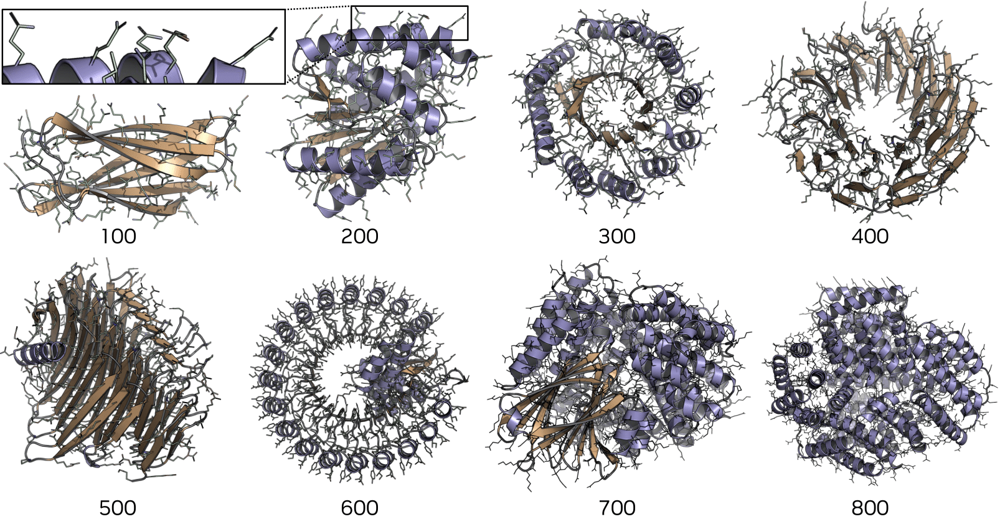

# La-Proteina 示例

本示例将 La-Proteina 集成到 OneScience 生物信息（AI for Biology）组件中，提供训练、蛋白质结构生成、生成结果评估与自编码器推理的统一入口。

## La-Proteina 简介

La-Proteina 是一种基于**部分隐变量流匹配（Partially Latent Flow Matching）**的蛋白质结构生成模型，能够直接生成全原子蛋白质结构及其对应的氨基酸序列。模型将蛋白质的骨架（backbone CA）显式建模，而序列和原子级细节则通过每个残基的固定维度隐变量来捕捉，从而有效避免显式侧链表示带来的挑战。

论文：_La-Proteina: Atomistic Protein Generation via Partially Latent Flow Matching_（arXiv 2025）。

- [论文链接](https://arxiv.org/abs/2507.09466)
- [项目主页](https://research.nvidia.com/labs/genair/la-proteina/)
- [Model Card++](./modelcard/model_card_overview.md)

<div align="center">
    
</div>

La-Proteina 在多个生成基准上取得了 state-of-the-art 性能，包括全原子协同可设计性（co-designability）、多样性、结构有效性以及原子级 motif 支架（motif scaffolding）。模型可生成最长约 800 个残基的蛋白质结构。

---

## 目录

- [功能定位](#功能定位)
- [环境准备](#环境准备)
- [数据与模型权重](#数据与模型权重)
- [脚本速查表](#脚本速查表)
- [详细使用说明](#详细使用说明)
  - [1. 训练 La-Proteina 主模型（`run_train.sh`）](#1-训练-la-proteina-主模型run_trainsh)
  - [2. 蛋白质结构生成（`run_generate.sh`）](#2-蛋白质结构生成run_generatesh)
  - [3. 生成结果评估（`run_evaluate.sh`）](#3-生成结果评估run_evaluatesh)
  - [4. 自编码器推理（`run_ae_infer.sh`）](#4-自编码器推理run_ae_infersh)
- [配置说明](#配置说明)
- [目录结构](#目录结构)
- [注意事项](#注意事项)
- [许可证与引用](#许可证与引用)

---

## 功能定位

- **蛋白质结构生成**：基于流匹配生成蛋白质主链（backbone CA）与局部隐变量（local latents）。
- **Motif 约束生成**：支持 motif 位置与序列约束，实现功能 motif 的骨架设计。
- **训练扩散模型**：在 PDB 数据集上训练 La-Proteina 主模型。
- **训练自编码器**：训练局部隐变量自编码器（local-latent autoencoder）。
- **评估生成结果**：计算生成结构的 RMSD、序列恢复率、(co-)designability 等指标。
- **自编码器推理**：对 PDB 结构进行编码-解码重建并评估重建质量。

---

## 环境准备

1. 参照项目根目录 [README.md](../../../README.md) 完成 OneScience（bio 领域）安装：

    ```bash
    bash install.sh bio
    注: 若出现huggingface-hub缺失，需要满足huggingface-hub>=0.34.0,<1.0
    可通过pip install huggingface-hub>=0.34.0,<1.0进行安装
    ```

2. 激活环境：

    ```bash
    conda activate onescience311
    ```

3. 确保 `ONESCIENCE_DATASETS_DIR` 环境变量已设置（通常由项目根目录 `env.sh` 自动配置）：

    ```bash
    source /path/to/onescience/env.sh
    ```

4. 可选：通过环境变量覆盖默认路径：

    ```bash
    export LAPROTEINA_ROOT=/path/to/la-proteina
    export LAPROTEINA_DATASET_DIR=/path/to/dataset
    export LAPROTEINA_CHECKPOINTS_DIR=/path/to/checkpoints_laproteina
    export DATA_PATH=/path/to/dataset
    ```

---

## 数据与模型权重

### 1. 数据集

脚本默认读取以下路径：

```
${ONESCIENCE_DATASETS_DIR}/la-proteina/dataset/pdb_train
```

- 训练/推理使用 PDB 结构数据集。
- 官方论文中模型主要在 AFDB 子集上训练，相关 ID 列表可从 [NVIDIA NGC - la_proteina_afdb_ids.zip](https://catalog.ngc.nvidia.com/orgs/nvidia/teams/clara/resources/la_proteina_afdb_ids.zip/files) 下载。
- 当前 OneScience 示例使用 `pdb_train` 作为训练和评估数据集。

### 2. 模型权重

所有 checkpoint 应下载并放置到：

```
${ONESCIENCE_DATASETS_DIR}/la-proteina/checkpoints_laproteina/
```

官方权重下载地址：[NVIDIA NGC - La-Proteina Weights & Data](https://catalog.ngc.nvidia.com/orgs/nvidia/teams/clara/collections/laproteina_weights_data/artifacts)

#### 隐变量扩散模型（Latent Diffusion）

| 模型 | 配置文件 | 说明 | 默认对应 AE |
|------|----------|------|-------------|
| LD1 | `inference_ucond_notri` | 无条件生成，无三角注意力层，最长 500 残基 | AE1 |
| LD2 | `inference_ucond_tri` | 无条件生成，含三角乘法更新层，最长 500 残基 | AE1 |
| LD3 | `inference_ucond_notri_long` | 无条件生成，无三角注意力层，300-800 残基 | AE2 |
| LD4 | `inference_motif_idx_aa` | 索引式（indexed）全原子 motif 支架 | AE3 |
| LD5 | `inference_motif_idx_tip` | 索引式（indexed） tip-原子 motif 支架 | AE3 |
| LD6 | `inference_motif_uidx_aa` | 非索引式（unindexed）全原子 motif 支架 | AE3 |
| LD7 | `inference_motif_uidx_tip` | 非索引式（unindexed） tip-原子 motif 支架 | AE3 |

#### 自编码器（Autoencoder）

| 模型 | 文件名 | 说明 |
|------|--------|------|
| AE1 | `AE1_ucond_512.ckpt` | 无条件生成最长 500 残基，与 LD1/LD2 配对 |
| AE2 | `AE2_ucond_800.ckpt` | 无条件生成 300-800 残基，与 LD3 配对 |
| AE3 | `AE3_motif.ckpt` | 原子级 motif 支架，与 LD4/LD5/LD6/LD7 配对 |

### 3. 默认路径汇总

| 用途 | 默认路径 |
|------|----------|
| 数据根目录 | `${ONESCIENCE_DATASETS_DIR}/la-proteina` |
| 训练数据集 | `${ONESCIENCE_DATASETS_DIR}/la-proteina/dataset/pdb_train` |
| 自编码器权重 | `${ONESCIENCE_DATASETS_DIR}/la-proteina/checkpoints_laproteina/AE1_ucond_512.ckpt` |
| 扩散模型权重 | `${ONESCIENCE_DATASETS_DIR}/la-proteina/checkpoints_laproteina/LD2_ucond_tri_512.ckpt` |

---

## 脚本速查表

以下 4 个 `bash` 脚本为本示例的官方入口，均可直接运行。

| 脚本 | 功能 | 推荐运行方式 | 默认输出 |
|------|------|--------------|----------|
| `scripts/run_train.sh` | 训练 La-Proteina 主模型 | `bash scripts/run_train.sh` | `./store/<run_name>/` |
| `scripts/run_generate.sh` | 蛋白质结构生成 | `bash scripts/run_generate.sh` | `./inference/inference_ucond_tri/` |
| `scripts/run_evaluate.sh` | 生成结构评估 | `bash scripts/run_evaluate.sh` | `./inference/inference_ucond_tri/evaluation/` |
| `scripts/run_ae_infer.sh` | 自编码器编码-解码推理 | `bash scripts/run_ae_infer.sh` | `./inference_ae/` |

以上脚本均位于 `examples/biosciences/laproteina/scripts/` 目录。

---

## 详细使用说明

建议在 `examples/biosciences/laproteina` 目录下运行脚本，以便输出集中管理。

### 1. 训练 La-Proteina 主模型（`run_train.sh`）

```bash
cd examples/biosciences/laproteina
bash scripts/run_train.sh
```

脚本会检查 `DATA_PATH/pdb_train` 与 `LAPROTEINA_CHECKPOINTS_DIR/AE1_ucond_512.ckpt` 是否存在，并自动设置 `PYTHONPATH` 与相关环境变量。

默认配置：`src/onescience/configs/bio/laproteina/training_local_latents.yaml`

**常用 Hydra 参数覆盖：**

```bash
# 单卡调试
bash scripts/run_train.sh hardware.ngpus_per_node_=1 single=true

# 指定运行名称
bash scripts/run_train.sh run_name=my_laproteina_run

# 覆盖数据集或网络配置（对应 motif 训练场景）
bash scripts/run_train.sh dataset=pdb/pdb_train_motif_aa nn=local_latents_score_nn_160M_motif_idx_aa
```

脚本内部调用：

```bash
python train_laproteina.py "+CK_PATH=$LAPROTEINA_ROOT" "$@"
```

| 环境变量 | 默认值 | 说明 |
|----------|--------|------|
| `LAPROTEINA_ROOT` | `${ONESCIENCE_DATASETS_DIR}/la-proteina` | 数据与权重根目录 |
| `LAPROTEINA_CHECKPOINTS_DIR` | `${LAPROTEINA_ROOT}/checkpoints_laproteina` | 自编码器权重目录 |
| `DATA_PATH` | `${LAPROTEINA_ROOT}/dataset` | 数据集目录 |

输出：

- `./store/<run_name>/`：训练日志、检查点与 Hydra 配置

---

### 2. 蛋白质结构生成（`run_generate.sh`）

```bash
cd examples/biosciences/laproteina
bash scripts/run_generate.sh
```

默认使用 `inference_ucond_tri` 配置进行无条件生成（LD2 模型 + AE1）。

脚本内部调用：

```bash
python infer_laproteina.py --config_name inference_ucond_tri "$@"
```

**切换生成配置：**

```bash
# 无条件生成（无三角注意力）
bash scripts/run_generate.sh --config_name inference_ucond_notri

# 无条件生成长链（300-800 残基）
bash scripts/run_generate.sh --config_name inference_ucond_notri_long

# 索引式全原子 motif 支架
bash scripts/run_generate.sh --config_name inference_motif_idx_aa

# 索引式 tip-原子 motif 支架
bash scripts/run_generate.sh --config_name inference_motif_idx_tip

# 非索引式全原子 motif 支架
bash scripts/run_generate.sh --config_name inference_motif_uidx_aa

# 非索引式 tip-原子 motif 支架
bash scripts/run_generate.sh --config_name inference_motif_uidx_tip
```

**各配置说明：**

| 配置名 | 对应模型 | 任务类型 | 默认生成长度 |
|--------|----------|----------|--------------|
| `inference_ucond_tri` | LD2 + AE1 | 无条件生成 | [100, 200, 300, 400, 500]，每种 100 个样本 |
| `inference_ucond_notri` | LD1 + AE1 | 无条件生成 | [100, 200, 300, 400, 500]，每种 100 个样本 |
| `inference_ucond_notri_long` | LD3 + AE2 | 无条件长链生成 | [300, 400, 500, 600, 700, 800]，每种 100 个样本 |
| `inference_motif_idx_aa` | LD4 + AE3 | 索引式全原子 motif 支架 | 由 `configs/generation/motif.yaml` 指定 |
| `inference_motif_idx_tip` | LD5 + AE3 | 索引式 tip-原子 motif 支架 | 由 `configs/generation/motif.yaml` 指定 |
| `inference_motif_uidx_aa` | LD6 + AE3 | 非索引式全原子 motif 支架 | 由 `configs/generation/motif.yaml` 指定 |
| `inference_motif_uidx_tip` | LD7 + AE3 | 非索引式 tip-原子 motif 支架 | 由 `configs/generation/motif.yaml` 指定 |

**关键推理参数说明：**

- `ckpt_name`：隐变量扩散模型权重文件名（仅文件名，不需要完整路径）。
- `autoencoder_ckpt_path`：自编码器权重完整路径。
- `self_cond`：是否使用自条件采样，官方评估默认开启。
- `sc_scale_noise`：alpha 碳原子与隐变量的噪声尺度。

输出：

- `./inference/<config_name>/`：生成的蛋白质结构文件与元数据

---

### 3. 生成结果评估（`run_evaluate.sh`）

```bash
cd examples/biosciences/laproteina
bash scripts/run_evaluate.sh
```

默认评估 `inference_ucond_tri` 配置对应的生成结果。

脚本内部调用：

```bash
python evaluate_laproteina.py --config_name inference_ucond_tri "$@"
```

**切换评估配置：**

```bash
bash scripts/run_evaluate.sh --config_name inference_motif_idx_aa
```

评估指标包括：

- 全原子 RMSD
- 序列恢复率（sequence recovery）
- (Co-)designability（需 ProteinMPNN 权重）
- Motif RMSD（motif 支架任务）
- Motif 序列恢复率（motif 支架任务）

**ProteinMPNN 权重准备：**

评估前需下载 ProteinMPNN 权重，可在项目根目录执行：

```bash
bash script_utils/download_pmpnn_weights.sh
```

输出：

- `./inference/<config_name>/evaluation/`：评估结果文件

---

### 4. 自编码器推理（`run_ae_infer.sh`）

```bash
cd examples/biosciences/laproteina
bash scripts/run_ae_infer.sh
```

对 PDB 数据集执行编码-解码重建，评估重建指标（如全原子 RMSD、序列恢复率等）。

脚本会检查 `DATA_PATH/pdb_train` 与 `AE1_ucond_512.ckpt` 是否存在。

脚本内部调用：

```bash
python infer_laproteina_ae.py "$@"
```

常用参数覆盖：

| 环境变量 | 默认值 | 说明 |
|----------|--------|------|
| `LAPROTEINA_ROOT` | `${ONESCIENCE_DATASETS_DIR}/la-proteina` | 数据与权重根目录 |
| `LAPROTEINA_CHECKPOINTS_DIR` | `${LAPROTEINA_ROOT}/checkpoints_laproteina` | 自编码器权重目录 |
| `DATA_PATH` | `${LAPROTEINA_ROOT}/dataset` | 数据集目录 |

输出：

- `./inference_ae/`：重建结构与评估指标

---

## 配置说明

所有推理配置基于 `src/onescience/configs/bio/laproteina/inference_base_release.yaml`，各实验配置通过覆盖部分参数得到。

**训练相关配置：**

- `src/onescience/configs/bio/laproteina/training_local_latents.yaml`：主模型训练
- `src/onescience/configs/bio/laproteina/training_ae.yaml`：自编码器训练

**生成相关配置：**

- `src/onescience/configs/bio/laproteina/inference_ucond_tri.yaml`
- `src/onescience/configs/bio/laproteina/inference_ucond_notri.yaml`
- `src/onescience/configs/bio/laproteina/inference_ucond_notri_long.yaml`
- `src/onescience/configs/bio/laproteina/inference_motif_idx_aa.yaml`
- `src/onescience/configs/bio/laproteina/inference_motif_idx_tip.yaml`
- `src/onescience/configs/bio/laproteina/inference_motif_uidx_aa.yaml`
- `src/onescience/configs/bio/laproteina/inference_motif_uidx_tip.yaml`
- `src/onescience/configs/bio/laproteina/inference_ae.yaml`

**Motif 任务定义：**

- `configs/generation/motif_dict.yaml`：motif 任务列表与 contig 字符串
- `configs/generation/motif.yaml`：每个任务的采样数量

> 注意：
> - 名称含 `_TIP` 后缀的任务用于 tip-原子模型（LD5/LD7）。
> - 名称不含 `_TIP` 后缀的任务用于全原子模型（LD4/LD6）。

---

## 目录结构

```
examples/biosciences/laproteina/
├── scripts/                          # 可执行脚本（已提供）
│   ├── run_train.sh                  # 训练 La-Proteina 主模型
│   ├── run_generate.sh               # 蛋白质结构生成
│   ├── run_evaluate.sh               # 生成结果评估
│   └── run_ae_infer.sh               # 自编码器推理/重建
├── train_laproteina.py               # 训练入口（Hydra 配置）
├── infer_laproteina.py               # 生成入口
├── evaluate_laproteina.py            # 评估入口
├── train_laproteina_ae.py            # 自编码器训练入口
├── infer_laproteina_ae.py            # 自编码器推理入口
└── README.md                         # 本文档
```

对应源码模块位于 `src/onescience/models/laproteina/`。

---

## 注意事项

- 运行脚本前需确保 `ONESCIENCE_DATASETS_DIR` 环境变量已正确设置。
- 训练脚本默认检查 `DATA_PATH/pdb_train` 与 `AE1_ucond_512.ckpt` 是否存在，缺失会报错退出。
- 当前集成中 `dataset=pdb` 已可用，`dataset=genie2` 与 `dataset=pdb_multimer` 在当前仓库快照中未打包，运行会显式报错。
- 脚本会自动设置 ROCm/DCU 相关的 `LD_LIBRARY_PATH`，在海光 DCU 平台可直接运行；在 CUDA 平台可忽略或按需调整。
- 生成 motif 支架结构时，请确保 LD 模型与对应的 AE 模型配对正确，否则可能因长度/任务不匹配导致失败。
- 评估 (co-)designability 需要 ProteinMPNN 权重，请提前运行 `script_utils/download_pmpnn_weights.sh` 下载。
- 所有脚本建议在 `examples/biosciences/laproteina` 目录下执行，以便输出目录统一。
- 通过 Hydra 覆盖配置时，可以使用 `+CK_PATH=...` 指定 checkpoint 根路径，脚本在未提供时会自动设置为 `LAPROTEINA_ROOT`。

---

## 许可证与引用

示例代码采用 Apache 2.0 许可证。La-Proteina 模型权重采用 [NVIDIA Open Model License Agreement](https://www.nvidia.com/en-us/agreements/enterprise-software/nvidia-open-model-license/)，其他材料采用 [CC-BY 4.0](https://creativecommons.org/licenses/by/4.0/legalcode)。

如果您在研究中使用了 La-Proteina，请引用原始论文：

```bibtex
@article{geffner2025laproteina,
  title={La-Proteina: Atomistic Protein Generation via Partially Latent Flow Matching},
  author={Geffner, Tomas and Didi, Kieran and Cao, Zhonglin and Reidenbach, Danny and Zhang, Zuobai and Dallago, Christian and Kucukbenli, Emine and Kreis, Karsten and Vahdat, Arash},
  journal={arXiv preprint arXiv:2507.09466},
  year={2025}
}
```
