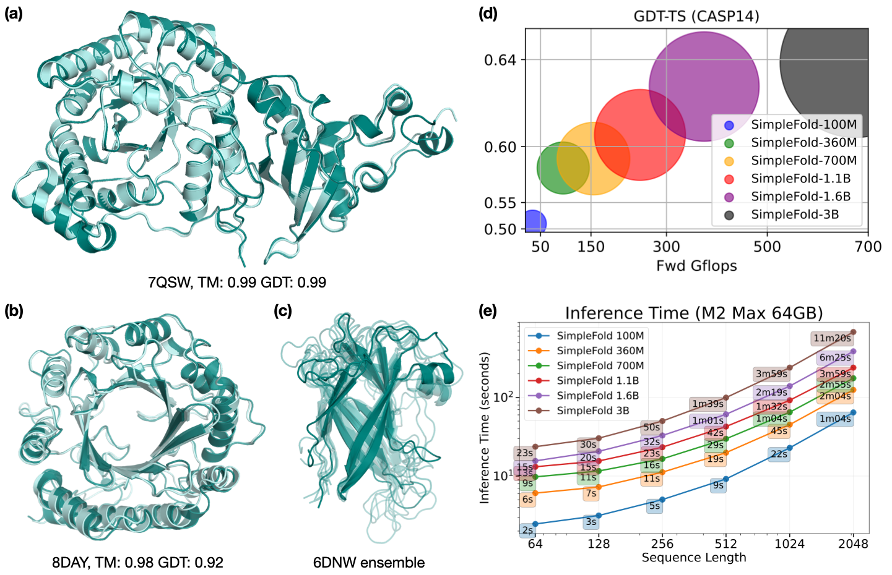

<h1 align="center"><strong>SimpleFold: 蛋白质折叠比你想象的更简单</strong></h1>


<div align="center">

[*SimpleFold: Folding Proteins is Simpler than You Think*](https://arxiv.org/abs/2509.18480)

*Yuyang Wang, Jiarui Lu, Navdeep Jaitly, Joshua M. Susskind, Miguel Angel Bautista*

[[`论文`](https://arxiv.org/abs/2509.18480)]  [[`引用`](#引用)]



</div>


## 简介

SimpleFold，这是第一个仅使用通用 Transformer 层的基于流匹配的蛋白质折叠模型。SimpleFold 不依赖于昂贵的模块（如三角注意力或配对表示偏置），并通过生成式流匹配目标进行训练。SimpleFold 最大扩展到 30 亿参数，并在超过 860 万个蒸馏蛋白质结构以及实验性 PDB 数据上进行训练。截止当前，SimpleFold 是迄今为止开发的最大规模的折叠模型。在标准折叠基准测试中，SimpleFold-3B 模型与最先进的基线相比取得了具有竞争力的性能。由于其生成式训练目标，SimpleFold 在集成预测方面也表现出色。SimpleFold 挑战了折叠领域对复杂领域特定架构设计的依赖，突出了蛋白质结构预测中一条替代但重要的进步途径。

</div>


## 官方说明

官方GitHub仓库地址
```
https://github.com/apple/ml-simplefold.git

```

## 示例

当前提供了一个 Jupyter notebook [`sample.ipynb`](sample.ipynb)，可以直接用于从示例蛋白质序列进行结构推理预测。

## 推理

安装 `simplefold` 包后，您可以通过以下命令行从目标 fasta 文件预测蛋白质结构。我们在推理中同时支持 [PyTorch](https://pytorch.org/) 和 [MLX](https://mlx-framework.org/) 后端。
```
simplefold \
    --simplefold_model simplefold_100M \  # 指定折叠模型：simplefold_100M/360M/700M/1.1B/1.6B/3B
    --num_steps 500 --tau 0.01 \        # 指定推理设置
    --nsample_per_protein 1 \           # 每个目标生成的构象数量
    --plddt \                           # 输出 pLDDT
    --fasta_path [FASTA_PATH] \         # 目标 fasta 目录或文件路径
    --output_dir [OUTPUT_DIR] \         # 输出目录路径
    --backend [mlx, torch]              # 选择 MLX 或 PyTorch 作为推理后端
```

## 评估

我们提供了不同模型大小的 SimpleFold 预测结构：
```
https://ml-site.cdn-apple.com/models/simplefold/cameo22_predictions.zip # CAMEO22 预测结构
https://ml-site.cdn-apple.com/models/simplefold/casp14_predictions.zip  # CASP14 预测结构
https://ml-site.cdn-apple.com/models/simplefold/apo_predictions.zip     # Apo 预测结构
https://ml-site.cdn-apple.com/models/simplefold/codnas_predictions.zip  # Fold-switch (CoDNaS) 预测结构
```
[openstructure](https://git.scicore.unibas.ch/schwede/openstructure/) 2.9.1 的 docker 镜像来评估折叠任务（即 CASP14/CAMEO22）的生成结构。启用 docker 镜像后，您可以通过以下命令运行评估：
```
python src/simplefold/evaluation/analyze_folding.py \
    --data_dir [PATH_TO_TARGET_MMCIF] \
    --sample_dir [PATH_TO_PREDICTED_MMCIF] \
    --out_dir [PATH_TO_OUTPUT] \
    --max-workers [NUMBER_OF_WORKERS]
```
要评估双状态预测结果（即 Apo/CoDNaS），需要先编译 [TMscore](https://zhanggroup.org/TM-score/TMscore.cpp)，然后通过以下命令运行评估：
```
python src/simplefold/evaluation/analyze_two_state.py \ 
    --data_dir [PATH_TO_TARGET_DATA_DIRECTORY] \
    --sample_dir [PATH_TO_PREDICTED_PDB] \
    --tm_bin [PATH_TO_TMscore_BINARY] \
    --task apo \ # 从 apo 和 codnas 中选择
    --nsample 5
```

## 训练

您也可以在本地训练或微调 SimpleFold。以下说明包含 SimpleFold 训练的详细信息。

### 数据准备

#### 训练目标

SimpleFold 在联合数据集上进行训练，包括来自 [PDB](https://www.rcsb.org/) 的实验结构，以及来自 [AFDB SwissProt](https://alphafold.ebi.ac.uk/download#swissprot-section) 和 [AFESM](https://afesm.foldseek.com/) 的蒸馏预测。我们训练中使用的过滤后的 SwissProt 和 AFESM 目标列表可在以下位置找到：
```
https://ml-site.cdn-apple.com/models/simplefold/swissprot_list.csv # 过滤后的 SwissProt 列表（约 27 万个目标）
https://ml-site.cdn-apple.com/models/simplefold/afesm_list.csv # 过滤后的 AFESM 目标列表（约 190 万个目标）
https://ml-site.cdn-apple.com/models/simplefold/afesme_dict.json # 过滤后的扩展 AFESM (AFESM-E) 列表（约 860 万个目标）
```
在 `afesme_dict.json` 中，数据以以下结构存储：
```
{
    cluster 1 ID: {"members": [protein 1 ID, protein 2 ID, ...]},
    cluster 2 ID: {"members": [protein 1 ID, protein 2 ID, ...]},
    ...
}
```

当然，您可以使用自定义数据集来训练或微调 SimpleFold 模型。以下说明列出了如何处理 SimpleFold 训练数据集。

#### 处理 mmcif 结构

要处理下载的 mmcif 文件，您需要安装 [Redis](https://redis.io/docs/latest/operate/oss_and_stack/install/archive/install-redis/) 并启动 Redis 服务器：
```
wget https://boltz1.s3.us-east-2.amazonaws.com/ccd.rdb
redis-server --dbfilename ccd.rdb --port 7777
```
然后您可以将 mmcif 文件处理为 SimpleFold 的输入格式：
```
python process_data.py \
    --data_dir [MMCIF_DIR]   # mmcif 文件目录
    --out_dir [OUTPUT_DIR]   # 处理后目标的目录
    --use-assembly --num-processes 1
```
进一步对处理后的结构进行分词：
```
python tokenize_data.py \
    --target_dir [TARGET_DIR]   # 处理后目标的目录
    --token_dir [TOKEN_DIR]   # 分词数据的目录
```

### 训练

模型配置基于 [`Hydra`](https://hydra.cc/docs/intro/)。示例训练配置可在 `configs/experiment/train` 中找到。要更改数据集和模型设置，可以参考 `configs/data` 和 `configs/model` 中的配置文件。启动 SimpleFold 训练：
```
python train.py
```
使用 FSDP 策略训练 SimpleFold：
```
python train_fsdp.py experiment=train_fsdp
```

### 训练实例
当前datasets目录下已准备文件64个,首先需要进行使用mmcif转换相关的输入格式；

更改configs里面数据路径配置文件，当前配置为./configs/data/pdb_sp.yaml
```
tokenize_data的路径：

    tokenized_dir: ./datasets/tokenized

process_data的路径:

    target_dir: ./datasets
    manifest_path: ./datasets/manifest.json
```

torchrun --standalone --nproc_per_node=8 train.py

srun --ntasks=8 --gpus-per-task=1 python train.py

或者非slurm系统使用 python train.py
