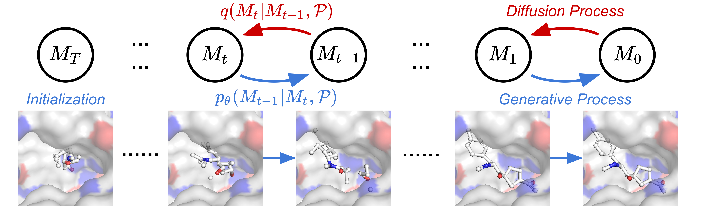

# TargetDiff 示例

本示例将 TargetDiff（基于 3D 等变扩散模型的靶点感知分子生成模型）集成到 OneScience 生物信息组件中，提供扩散模型训练、分子采样、生成结果评估以及蛋白-配体亲和力预测的一站式入口。

TargetDiff 原始论文：<u003c3D Equivariant Diffusion for Target-Aware Molecule Generation and Affinity Predictionu003e>（ICLR 2023）。[[PDF]](https://openreview.net/pdf?id=kJqXEPXMsE0)



---

## 目录

- [功能定位](#功能定位)
- [环境准备](#环境准备)
- [数据与预训练权重](#数据与预训练权重)
- [脚本速查表](#脚本速查表)
- [详细使用说明](#详细使用说明)
  - [1. 扩散模型训练（`train_diiffusion.sh`）](#1-扩散模型训练train_diffusionsh)
  - [2. 分子采样](#2-分子采样)
  - [3. 生成分子评估](#3-生成分子评估)
  - [4. 亲和力预测模型训练（`train_prop.sh`）](#4-亲和力预测模型训练train_propsh)
  - [5. 亲和力预测评估（`eval_prop.py`）](#5-亲和力预测评估eval_proppy)
  - [6. 亲和力预测推理（`inference.sh`）](#6-亲和力预测推理inferencesh)
- [数据预处理](#数据预处理)
- [目录结构](#目录结构)
- [注意事项](#注意事项)
- [引用](#引用)

---

## 功能定位

- **靶点感知分子生成**：以蛋白口袋为条件，生成符合三维几何约束的候选配体分子。
- **扩散模型训练**：在 CrossDocked2020 数据集上训练 TargetDiff 扩散生成模型。
- **分子采样**：支持从测试集口袋或自定义 PDB 口袋文件采样候选分子。
- **生成结果评估**：对采样得到的分子进行稳定性、多样性及对接打分评估。
- **结合亲和力预测**：基于 EGNN 预测蛋白-配体复合物的结合亲和力。
- **亲和力模型训练**：在 PDBbind 数据集上训练属性预测模型。

---

## 环境准备

### 1. 安装 OneScience

参考项目根目录 [README.md](../../../README.md) 完成 OneScience（bio 领域）安装：

```bash
bash install.sh bio
```

激活 Conda 环境：

```bash
conda activate onescience311
```

### 2. 依赖说明

TargetDiff 原始实现依赖 PyTorch、PyTorch Geometric、RDKit 等。在 OneScience 环境中已通过 `install.sh bio` 完成安装，无需重复安装。手动运行时若遇到依赖问题，可参考以下版本：

| 包 | 参考版本 |
|---|---|
| Python | 3.8 / 3.11（OneScience 默认 3.11） |
| PyTorch | ≥ 1.9.0 |
| PyTorch Geometric | ≥ 2.0 |
| RDKit | 2022.03.2 或兼容版本 |
| OpenBabel | 最新版 |

若需对接评估（`vina_score` / `vina_dock` / `qvina`），还需安装：

```bash
pip install meeko==0.1.dev3 scipy pdb2pqr vina==1.2.2
python -m pip install git+https://github.com/Valdes-Tresanco-MS/AutoDockTools_py3
```

### 3. 环境变量

确保 `ONESCIENCE_DATASETS_DIR` 与 `ONESCIENCE_MODELS_DIR` 已设置（通常由 `env.sh` 自动配置）：

```bash
source /path/to/onescience/env.sh
```

---

## 数据与预训练权重

### 1. 分子生成数据（CrossDocked2020）

训练和评估需要以下数据，建议放在 `${ONESCIENCE_DATASETS_DIR}/targetdiff/data/` 下：

| 文件/目录 | 说明 | 来源 |
|-----------|------|------|
| `crossdocked_v1.1_rmsd1.0_pocket10/` | 预处理后的 CrossDocked2020 口袋数据 | 官方 Google Drive 或自行预处理 |
| `crossdocked_pocket10_pose_split.pt` | 训练/验证/测试划分文件 | 官方 Google Drive |
| `test_set/` | 原始 PDB 文件，用于 Vina 对接评估 | 官方 Google Drive 解压后得到 |

官方数据下载地址：https://drive.google.com/drive/folders/1j21cc7-97TedKh_El5E34yI8o5ckI7eK?usp=share_link

如需从头处理 CrossDocked2020，参见下文 [CrossDocked2020 数据预处理](#crossdocked2020-数据预处理)。

### 2. 亲和力预测数据（PDBBind）

监督学习使用 PDBBind 数据集，可从 http://www.pdbbind.org.cn 下载。本示例默认使用 PDBBind v2020，测试集使用 v2016 coreset：

| 文件/目录 | 说明 |
|-----------|------|
| `pdbbind_v2020/` | PDBBind v2020 原始数据 |
| `pdbbind_v2016/coreset/` | PDBBind v2016 coreset 测试集 |

### 3. 预训练权重

官方提供的预训练权重可下载后放到 `${ONESCIENCE_MODELS_DIR}/targetdiff/pretrained_models/`：

| 权重 | 文件名 | 说明 |
|------|--------|------|
| 扩散生成模型 | `pretrained_diffusion.pt` | 用于分子采样 |
| 亲和力预测模型 | `egnn_pdbbind_v2016.pt` | 用于亲和力预测推理 |

官方权重下载地址：https://drive.google.com/drive/folders/1-ftaIrTXjWFhw3-0Twkrs5m0yX6CNarz?usp=share_link

### 4. 默认路径汇总

| 用途 | 默认路径 |
|------|----------|
| 扩散训练数据 | `${ONESCIENCE_DATASETS_DIR}/targetdiff/data/crossdocked_v1.1_rmsd1.0_pocket10` |
| 数据划分文件 | `${ONESCIENCE_DATASETS_DIR}/targetdiff/data/crossdocked_pocket10_pose_split.pt` |
| 对接评估蛋白根目录 | `${ONESCIENCE_DATASETS_DIR}/targetdiff/data/test_set` |
| PDBbind 数据 | `${ONESCIENCE_DATASETS_DIR}/targetdiff/data/pdbbind_v2020` |
| 亲和力预测权重 | `${ONESCIENCE_MODELS_DIR}/targetdiff/pretrained_models/egnn_pdbbind_v2016.pt` |
| 采样输入示例 | `${ONESCIENCE_DATASETS_DIR}/targetdiff/examples/3ug2_protein.pdb` |
| 采样配体示例 | `${ONESCIENCE_DATASETS_DIR}/targetdiff/examples/3ug2_ligand.sdf` |

---

## 脚本速查表

以下 4 个 `bash` 脚本为本示例的官方入口，均可直接运行。

| 脚本 | 功能 | 推荐运行方式 | 输出 |
|------|------|--------------|------|
| `train_diffusion.sh` | 训练 TargetDiff 扩散模型 | 在 `targetdiff` 目录下执行 `bash train_diffusion.sh` | `logs_diffusion/` |
| `scripts/batch_sample_diffusion.sh` | 多节点/多卡批量采样 | `bash scripts/batch_sample_diffusion.sh configs/sampling.yml outputs 4 0 0` | `outputs/result_*.pt` |
| `train_prop.sh` | 训练亲和力预测模型 | `bash train_prop.sh` | `logs_prop/` |
| `inference.sh` | 亲和力预测推理（默认 3ug2 示例） | `bash inference.sh` | 控制台输出 |

> 注：脚本名 `train_diffusion.sh` 保持仓库原拼写不变。

---

## 详细使用说明

### 1. 扩散模型训练（`train_diffusion.sh`）

`train_diffusion.sh` 依赖当前工作目录来定位项目根路径，**请在 `examples/biosciences/targetdiff` 目录下执行**：

```bash
cd examples/biosciences/targetdiff
bash train_diffusion.sh
```

默认读取 `configs/training.yml`，在 CrossDocked2020 口袋数据集上训练，日志与检查点保存在 `./logs_diffusion/`。

**自定义配置或覆盖参数：**

```bash
# 指定自定义配置文件
bash train_diffusion.sh configs/custom_training.yml

# 命令行覆盖训练参数
bash train_diffusion.sh --train.batch_size 8 --train.max_iters 500000
```

**主要训练参数：**

| 参数 | 默认值 | 说明 |
|------|--------|------|
| `data.path` | `${ONESCIENCE_DATASETS_DIR}/targetdiff/data/crossdocked_v1.1_rmsd1.0_pocket10` | 训练数据目录 |
| `data.split` | `${ONESCIENCE_DATASETS_DIR}/targetdiff/data/crossdocked_pocket10_pose_split.pt` | 训练/验证/测试划分文件 |
| `train.batch_size` | `4` | 批次大小 |
| `train.max_iters` | `10000000` | 最大迭代次数 |
| `train.lr` | `5.e-4` | 学习率 |
| `logdir` | `./logs_diffusion` | 日志输出目录 |

---

### 2. 分子采样

#### 2.1 测试集单条数据采样（无独立 sh 脚本）

在 `examples/biosciences/targetdiff` 目录下执行：

```bash
export PYTHONPATH=../../../src:$PYTHONPATH
python -m scripts.sample_diffusion configs/sampling.yml -i 0 --batch_size 50 --result_path ./outputs
```

参数说明：

| 参数 | 是否必填 | 说明 |
|------|----------|------|
| `config` | 是 | 采样配置文件路径，例如 `configs/sampling.yml` |
| `-i` / `--data_id` | 是 | 测试集中的数据索引，取值范围为 `0` 到 `99` |
| `--batch_size` | 否 | 每个数据点的采样数量，默认 `100` |
| `--result_path` | 否 | 结果输出目录，默认 `./outputs` |
| `--device` | 否 | 计算设备，默认 `cuda:0` |

该脚本从 `configs/sampling.yml` 中读取扩散模型检查点，对测试集第 `i` 个口袋生成候选配体分子，结果保存为 `result_i.pt`。

#### 2.2 多卡批量采样（`scripts/batch_sample_diffusion.sh`）

```bash
cd examples/biosciences/targetdiff
bash scripts/batch_sample_diffusion.sh configs/sampling.yml outputs 4 0 0
```

参数说明：

| 参数 | 说明 |
|------|------|
| `$1` | 采样配置文件路径 |
| `$2` | 结果输出目录 |
| `$3` | 总工作节点数 |
| `$4` | 当前节点编号（从 0 开始） |
| `$5` | 起始数据索引 |

多卡并行示例：

```bash
CUDA_VISIBLE_DEVICES=0 bash scripts/batch_sample_diffusion.sh configs/sampling.yml outputs 4 0 0 &
CUDA_VISIBLE_DEVICES=1 bash scripts/batch_sample_diffusion.sh configs/sampling.yml outputs 4 1 0 &
CUDA_VISIBLE_DEVICES=2 bash scripts/batch_sample_diffusion.sh configs/sampling.yml outputs 4 2 0 &
CUDA_VISIBLE_DEVICES=3 bash scripts/batch_sample_diffusion.sh configs/sampling.yml outputs 4 3 0 &
wait
```

脚本内部固定 `TOTAL_TASKS=100`、`BATCH_SIZE=50`，按索引取模分配给各节点。

#### 2.3 自定义 PDB 口袋采样（无独立 sh 脚本）

```bash
cd examples/biosciences/targetdiff
export PYTHONPATH=../../../src:$PYTHONPATH
python -m scripts.sample_for_pocket configs/sampling.yml \
    --pdb_path /path/to/pocket.pdb \
    --result_path ./outputs_pdb \
    --num_samples 100 \
    --batch_size 100
```

参数说明：

| 参数 | 是否必填 | 说明 |
|------|----------|------|
| `config` | 是 | 采样配置文件路径 |
| `--pdb_path` | 是 | 蛋白口袋 PDB 文件路径（建议为 10Å 口袋） |
| `--result_path` | 否 | 结果输出目录，默认 `./outputs_pdb` |
| `--num_samples` | 否 | 采样分子数量，默认读取配置文件 |
| `--batch_size` | 否 | 批量大小，默认 `100` |
| `--device` | 否 | 计算设备，默认 `cuda:0` |

采样结果会保存为 `outputs_pdb/sample.pt`，成功重建的分子会额外输出到 `outputs_pdb/sdf/`。

---

### 3. 生成分子评估

#### 3.1 从采样结果评估

```bash
cd examples/biosciences/targetdiff
export PYTHONPATH=../../../src:$PYTHONPATH
python scripts/evaluate_diffusion.py ./outputs --docking_mode vina_score --protein_root /path/to/protein_root
```

参数说明：

| 参数 | 是否必填 | 说明 |
|------|----------|------|
| `sample_path` | 是 | 采样结果目录，包含 `result_*.pt` 文件 |
| `--docking_mode` | 是 | 对接模式，可选 `none`、`vina_score`、`vina_dock`、`qvina` |
| `--protein_root` | 否 | 原始蛋白文件根目录，用于对接评估 |
| `--eval_step` | 否 | 评估第几步的采样结果，默认 `-1`（最后一步） |
| `--eval_num_examples` | 否 | 评估样本数量，默认全部 |
| `--exhaustiveness` | 否 | 对接搜索强度，默认 `16` |
| `--save` | 否 | 是否保存评估结果，默认 `True` |

支持的对接模式：

| 模式 | 说明 |
|------|------|
| `none` | 仅计算 validity、uniqueness、novelty 等指标，不进行对接 |
| `vina_score` | 使用 AutoDock Vina 对生成分子进行打分 |
| `vina_dock` | 使用 AutoDock Vina 对生成分子进行重新对接 |
| `qvina` | 使用 QuickVina 进行对接 |

首次运行 `vina_score` 或 `vina_dock` 模式时，需要一定时间准备 `pdbqt` 和 `pqr` 文件。

#### 3.2 从 meta 文件评估

官方提供了已采样并对接好的 meta 文件（包含 TargetDiff 及 CVAE、AR、Pocket2Mol 等基线），可直接下载评估：

| Meta 文件 | 对应论文 |
|-----------|----------|
| `crossdocked_test_vina_docked.pt` | 原始测试集对接结果 |
| `cvae_vina_docked.pt` | liGAN |
| `ar_vina_docked.pt` | AR |
| `pocket2mol_vina_docked.pt` | Pocket2Mol |
| `targetdiff_vina_docked.pt` | TargetDiff |

官方 meta 文件下载地址：https://drive.google.com/drive/folders/19imu-mlwrjnQhgbXpwsLgA17s1Rv70YS?usp=share_link

评估命令：

```bash
cd examples/biosciences/targetdiff
export PYTHONPATH=../../../src:$PYTHONPATH
python scripts/evaluate_from_meta.py sampling_results/targetdiff_vina_docked.pt --result_path eval_targetdiff
```

参数说明：

| 参数 | 是否必填 | 说明 |
|------|----------|------|
| `meta_file` | 是 | 包含采样与对接结果的 `.pt` 文件 |
| `--result_path` | 否 | 评估结果输出目录，默认 `eval_results` |

---

### 4. 亲和力预测模型训练（`train_prop.sh`）

```bash
cd examples/biosciences/targetdiff
bash train_prop.sh
```

该脚本自动完成以下步骤：

1. 从 PDBbind refined set 中提取结合口袋。
2. 按照 coreset 划分训练/验证/测试集。
3. 训练基于 EGNN 的蛋白-配体结合亲和力预测模型。

默认配置为 `configs/prop/pdbbind_general_egnn.yml`，训练日志与检查点保存在 `./logs_prop/`。

**自定义配置：**

```bash
bash train_prop.sh configs/prop/custom_egnn.yml
```

**关键环境变量：**

| 环境变量 | 说明 | 默认值 |
|----------|------|--------|
| `PDBBIND_SOURCE` | PDBbind 原始数据目录 | `${ONESCIENCE_DATASETS_DIR}/targetdiff/data/pdbbind_v2020` |
| `CORESET_PATH` | coreset 测试集目录 | `${ONESCIENCE_DATASETS_DIR}/targetdiff/data/pdbbind_v2016/coreset` |
| `PROCESSED_ROOT` | 处理后数据输出根目录 | `./data/pdbbind_v2020_processed` |

---

### 5. 亲和力预测评估（`eval_prop.py`）

使用训练好的亲和力预测模型在测试集上评估，官方在 PDBBind v2016 上的预期指标：

| RMSE | MAE | R² | Pearson | Spearman |
|------|-----|----|---------|----------|
| 1.316 | 1.031 | 0.633 | 0.797 | 0.782 |

运行方式：

```bash
cd examples/biosciences/targetdiff
export PYTHONPATH=../../../src:$PYTHONPATH
python scripts/property_prediction/eval_prop.py \
    --ckpt_path ${ONESCIENCE_MODELS_DIR}/targetdiff/pretrained_models/egnn_pdbbind_v2016.pt \
    --device cuda
```

参数说明：

| 参数 | 是否必填 | 说明 |
|------|----------|------|
| `--ckpt_path` | 是 | 模型权重路径 |
| `--device` | 否 | 计算设备，默认 `cuda` |
| `--seed` | 否 | 随机种子，默认 `2021` |

---

### 6. 亲和力预测推理（`inference.sh`）

```bash
cd examples/biosciences/targetdiff
bash inference.sh
```

该脚本默认对示例蛋白-配体对 `3ug2` 进行亲和力预测，使用默认权重和示例数据：

- 模型权重：`${ONESCIENCE_MODELS_DIR}/targetdiff/pretrained_models/egnn_pdbbind_v2016.pt`
- 蛋白：`${ONESCIENCE_DATASETS_DIR}/targetdiff/examples/3ug2_protein.pdb`
- 配体：`${ONESCIENCE_DATASETS_DIR}/targetdiff/examples/3ug2_ligand.sdf`
- 亲和力类型：默认 `Kd`
- 计算设备：默认 `cuda`

官方示例预期输出：

```text
PDB ID: examples/3ug2_protein.pdb Prediction: Kd=5.23e-09 m
```

真实值：Kd=5.6 nM。

> 提示：如需更换输入蛋白/配体/权重，请修改 `inference.sh` 中对应的变量，或设置 `ONESCIENCE_MODELS_DIR` / `ONESCIENCE_DATASETS_DIR` 环境变量。亲和力类型和设备可通过脚本的第 4、5 个位置参数覆盖，例如 `bash inference.sh _ _ _ Ki cuda`。

---

## 数据预处理

### CrossDocked2020 数据预处理

如需从头处理 CrossDocked2020 数据，按以下步骤执行：

1. 下载 CrossDocked2020 v1.1 并保存到 `data/CrossDocked2020`。
2. 过滤 RMSD < 1Å 的样本：

    ```bash
    export PYTHONPATH=../../../src:$PYTHONPATH
    python scripts/data_preparation/clean_crossdocked.py \
        --source data/CrossDocked2020 \
        --dest data/crossdocked_v1.1_rmsd1.0 \
        --rmsd_thr 1.0
    ```

3. 从蛋白中提取 10Å 结合口袋：

    ```bash
    python scripts/data_preparation/extract_pockets.py \
        --source data/crossdocked_v1.1_rmsd1.0 \
        --dest data/crossdocked_v1.1_rmsd1.0_pocket10
    ```

4. 划分训练集与测试集：

    ```bash
    python scripts/data_preparation/split_pl_dataset.py \
        --path data/crossdocked_v1.1_rmsd1.0_pocket10 \
        --dest data/crossdocked_pocket10_pose_split.pt \
        --fixed_split data/split_by_name.pt
    ```

### PDBbind 数据预处理

亲和力预测训练脚本 `train_prop.sh` 已自动完成口袋提取与数据集划分。如需单独执行，可使用以下命令：

```bash
export PYTHONPATH=../../../src:$PYTHONPATH

python scripts/property_prediction/extract_pockets.py \
    --source data/pdbbind_v2020 \
    --dest data/pdbbind_v2020_processed \
    --subset refined \
    --num_workers 16

python scripts/property_prediction/pdbbind_split.py \
    --split_mode coreset \
    --index_path data/pdbbind_v2020_processed/pocket_10_refined/index.pkl \
    --test_path data/pdbbind_v2016/coreset \
    --save_path data/pdbbind_v2020_processed/pocket_10_refined/split.pt
```

---

## 目录结构

```
examples/biosciences/targetdiff/
├── train_diffusion.sh                # 扩散模型训练入口脚本
├── train_prop.sh                     # 亲和力预测模型训练入口脚本
├── inference.sh                      # 亲和力预测推理入口脚本
├── scripts/
│   ├── batch_sample_diffusion.sh     # 多卡批量采样脚本
│   ├── train_diffusion.py            # 扩散模型训练 Python 入口
│   ├── sample_diffusion.py           # 测试集分子采样入口
│   ├── sample_for_pocket.py          # 自定义 PDB 口袋采样入口
│   ├── evaluate_diffusion.py         # 生成结果评估入口
│   ├── evaluate_from_meta.py         # 从 meta 文件评估入口
│   ├── dock_baseline.py              # 对接基线脚本
│   ├── dock_testset.py               # 测试集对接脚本
│   ├── likelihood_est_diffusion.py   # 扩散似然估计脚本
│   ├── data_preparation/             # 数据预处理脚本
│   │   ├── clean_crossdocked.py
│   │   ├── extract_pockets.py
│   │   └── split_pl_dataset.py
│   └── property_prediction/          # 亲和力预测相关脚本
│       ├── train_prop.py
│       ├── fixed_inference.py
│       ├── inference.py
│       ├── eval_prop.py
│       ├── extract_pockets.py
│       └── pdbbind_split.py
├── configs/
│   ├── training.yml                  # 扩散模型训练配置
│   ├── sampling.yml                  # 分子采样配置
│   └── prop/
│       ├── pdbbind_general_egnn.yml
│       └── pdbbind_general_egnn_enc_final_h.yml
└── assets/                           # 模型架构示意图
```

模型实现位于 `src/onescience/models/targetdiff`。

---

## 注意事项

- 运行脚本前请确保 `ONESCIENCE_DATASETS_DIR` 与 `ONESCIENCE_MODELS_DIR` 环境变量已正确设置。
- `train_diffusion.sh` 需要**在 `examples/biosciences/targetdiff` 目录下**执行；其余 `bash` 脚本使用 `BASH_SOURCE` 定位，可在任意目录执行。
- 手动运行 Python 入口时，需将项目根目录的 `src` 加入 `PYTHONPATH`，例如 `export PYTHONPATH=/path/to/onescience/src:$PYTHONPATH`。
- 脚本会自动设置 ROCm/DCU 相关的 `LD_LIBRARY_PATH`，在海光 DCU 平台可直接运行；在 CUDA 平台可忽略或按需调整。
- 分子采样与评估依赖 RDKit、OpenBabel 及可选的 AutoDock Vina/QVina。
- 亲和力预测模型基于 PDBbind 训练，输入蛋白与配体建议预先添加氢原子。
- 训练脚本默认单卡运行，多卡训练请调整 `CUDA_VISIBLE_DEVICES` 或 `HIP_VISIBLE_DEVICES` 及分布式配置。

---

## 引用

如果您在研究中使用了 TargetDiff，请引用原始论文：

```bibtex
@inproceedings{guan3d,
  title={3D Equivariant Diffusion for Target-Aware Molecule Generation and Affinity Prediction},
  author={Guan, Jiaqi and Qian, Wesley Wei and Peng, Xingang and Su, Yufeng and Peng, Jian and Ma, Jianzhu},
  booktitle={International Conference on Learning Representations},
  year={2023}
}
```
