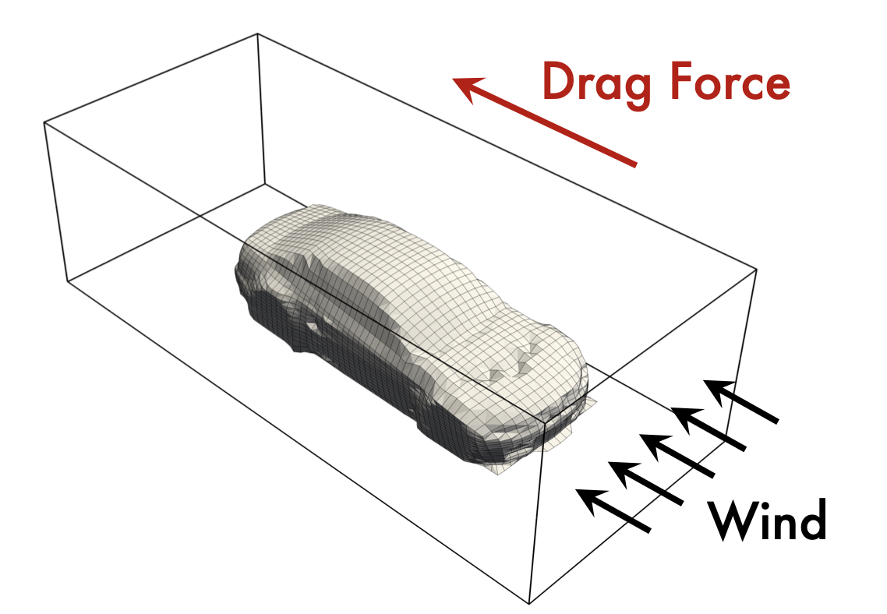

# 模型简介

这是一个用于预测汽车设计任务的模型，它用于预测驾驶汽车周围的风速和表面压力，以此来计算风阻系数。模型参照[Transolver](https://arxiv.org/abs/2402.02366) 中的开源模型代码进行构建。

<p align="center">

<br><br>
<b>Figure 1.</b> 汽车设计任务. 
</p>

**模型结构** 

Transolver是一种基于物理感知令牌的Transformer PDE求解器，通过将网格点自适应划分为物理相关的切片，实现令牌级别的物理注意力计算，显著降低计算复杂度并提升几何泛化能力。其核心特点包括线性复杂度的高效注意力机制、对非结构化网格的天然适应性，以及在复杂物理场景和分布外条件下的强泛化性能。

除了基础版本Transolver我们还引入了Transolver++模型[[Paper]](https://arxiv.org/pdf/2502.02414)，采用了 局部自适应机制 和 切片重参数化（slice reparameterization） 技术。这些方法使得模型能够自适应地控制切片权重的分布，避免了物理状态之间的区分度丧失。具体来说，Ada-Temp 调整通过动态微调 softmax 函数的温度，确保在必要时产生更加集中或尖锐的分布。此外，使用 Gumbel-Softmax 进行可微分采样，使得 Transolver++ 即使在大规模数据上，也能保持强健和多样的物理状态表示。

可以通过conf目录下的transolver_car.yaml文件中选择相应的Transolver++模型。

**数据集准备** 

原始数据可以此处[[下载]](http://www.nobuyuki-umetani.com/publication/mlcfd_data.zip)，由[Nobuyuki Umetani](https://dl.acm.org/doi/abs/10.1145/3197517.3201325)提供。

曙光新一代机器平台数据集统一存放在 = /public/onestore/onedatasets/Transolver-Car-Design，使用前需要

```bash
source ../../../env.sh
```

**训练** 

1. DCU需要额外安装torch_cluster依赖包，可以参考 [跳转到自定义安装与配置](#自定义安装与配置)

2. 非DCU环境请执行以下命令安装torch_cluster依赖包

```shell
pip install torch_cluster
```

**单卡训练**

```shell
python train.py
```

详细的训练参数可以参考conf/transolver_car.yaml文件中的参数注释，需要修改数据的路径

**多卡训练**

```shell
mpirun -np <num_GPUs> --allow-run-as-root python train.py
```

若在 Docker 容器内运行，多GPU命令可能需加 `--allow-run-as-root`

torchrun启动多节点多卡训练：

```shell
torchrun --standalone --nnodes=<num_nodes> --nproc_per_node=<num_GPUs> train.py
```

如果在支持slurm作业调度系统的环境下进行跨节点并行训练，可以执行如下脚本：

```shell
sbatch slurm.sh
```

注意: 您需要将参数 `data_dir `和 `preprocessed_save_dir `更改为数据集路径。这里的`data_dir`用于原始数据，`preprocessed_save_dir`则用于保存预处理后的数据。

**推理和可视化:**

```bash
python inference.py
```

生成可视化结果：启用 save_vtk: True 保存 VTK 文件，可使用 ParaView 进行高级可视化。启用 visualize: True 生成静态可视化图片。

**许可证** 

Transolver-Car-Design 项目（包括代码和模型参数）在[Apache 2.0](https://github.com/thuml/Transolver/blob/main/LICENSE)许可下提供，可免费用于学术研究和商业用途。